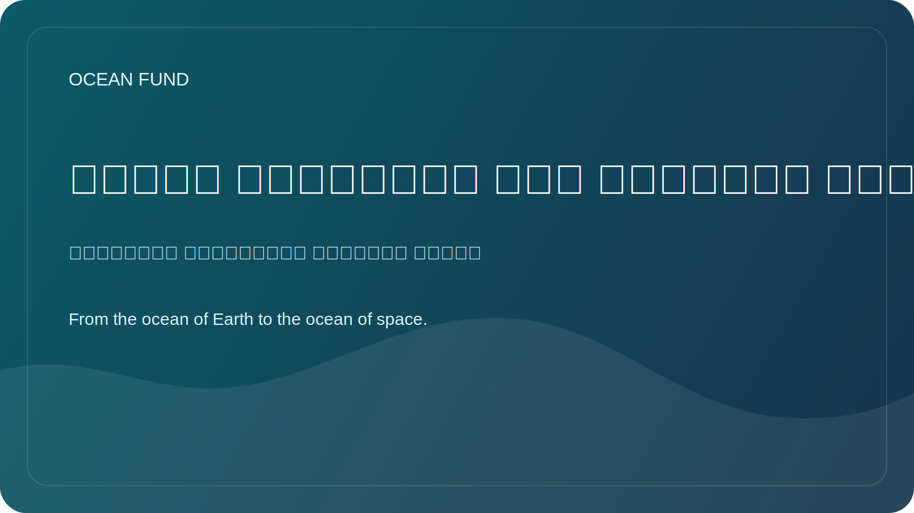

# نماذج المنظمات غير الربحية والتبرع للمحيط

This page tracks nonprofit ocean organizations whose public donation systems, membership structures, and supporter pathways are useful reference points for Ocean Fund.

Verified against official sites on 12 May 2026.

## Reference Organizations

- Ocean Conservancy
- Oceana
- Surfrider Foundation
- The Ocean Cleanup
- Mission Blue
- Coral Reef Alliance
- Reef Check
- Oceanic Society

## Donation Patterns Worth Studying

- one-time and monthly giving;
- supporter identity through membership or named circles;
- tribute, memorial, and campaign giving;
- peer-to-peer fundraising;
- advanced paths such as DAF, stock, QCD, bequests, or legacy societies;
- mission-linked giving such as adoption, expeditions, cleanup campaigns, or sponsor circles.

## Working Rule

Borrow structural lessons, not claims, numbers, legal flows, or emotional framing without adaptation.
