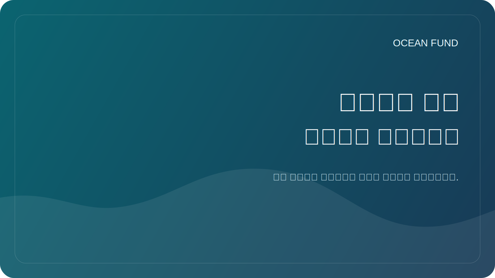

# شريك صفحة واحدة

هذه الصفحة عبارة عن ملخص عام مدمج للمؤسسات والمنتديات والمعارض والمؤتمرات والتواصل مع أول شخص.

## صندوق المحيط

يعد Ocean Fund مركزًا مفتوحًا للمشروعات المتعلقة بالمحيطات والمناخ والتنوع البيولوجي والبيانات البحرية والتعليم والشراكات الدولية.

> من محيط الأرض إلى محيط الفضاء.

## ما نقوم ببنائه

يقوم Ocean Fund ببناء بنية تحتية عامة للبحث والتعليم والتكنولوجيا حول فهم المحيطات وحمايتها. يربط المشروع بين العلوم البحرية ومراقبة الأرض والمعرفة العامة والاستكشاف طويل المدى في مساحة تعاون مفتوحة واحدة.

## لماذا هذا مهم؟

يقع المحيط في مركز تنظيم المناخ، والتنوع البيولوجي، والأنظمة الغذائية، والقدرة على الصمود الساحلي، والثقافة، والعلوم، والخيال العام. ومع ذلك، فإن فرص البيانات والتعليم والبحث والشراكة غالبا ما تكون مجزأة. تم إنشاء Ocean Fund لتسهيل ربط هذه الطبقات بطريقة عامة ومنظمة وجاهزة للتعاون.

## ما يمكن أن يتوقعه الشريك

- إطار واضح للتعاون العام؛
- طريق اتصال أول واقعي ومنخفض الضوضاء؛
- صيغ بداية صغيرة وملموسة بدلاً من لغة الشراكة الغامضة؛
- بيئة مشروع مفتوحة للمستندات والقضايا والمناقشات والمواد القابلة لإعادة الاستخدام.

## تنسيقات التعاون الأول الجيدة

- محاضرة عامة أو ندوة؛
- موجز بحث مشترك؛
- مراجعة مجموعة البيانات أو رسم الخرائط السريعة؛
- المعرض أو الوحدة التعليمية؛
- ورشة عمل أو لجنة أو جلسة مؤتمر؛
- تنسيق العلوم العامة من المحيط إلى الفضاء.

## لمن هذا

- الجامعات ومعاهد البحوث؛
- المتاحف والمراكز العلمية والقباب السماوية.
- المنظمات غير الربحية والمؤسسات؛
- المؤتمرات والمنتديات والمعارض؛
- مجتمعات البيانات مفتوحة المصدر؛
- المؤسسات العامة العاملة عبر المحيطات أو المناخ أو التنوع البيولوجي أو التعليم.

## الخطوة الأولى الآمنة العامة

ابدأ بالمعلومات العامة فقط:

- من أنت؛
- سبب أهمية التعاون؛
- ما هي النتيجة التي يمكن أن تواجه الجمهور؟
- ما هي الخطوة الأولى الصغيرة المنطقية.

## طريق الدخول العام

1. Read [للشركاء](partners.md).
2. Read [نسخة المهمة العامة](mission-copy.md).
3. Review [الشراكات](../docs/partners.md).
4. استخدم فئة المناقشة العامة `Partnerships` أو المشكلة المتعقبة للخطوة التالية.

## قواعد الدعاية

- لا وثائق خاصة؛
- لا اتصالات شخصية.
- لا توجد شروط مالية في المواضيع العامة؛
- لا توجد مطالبات شراكة غير مؤكدة؛
- لا توجد تصريحات مبالغ فيها حول الحالة أو النطاق.

## إعادة الاستخدام

هذه الصفحة الواحدة هي المرفق العام أو الرابط الموصى به لـ:

- رسائل البريد الإلكتروني الأولى للشريك؛
- التواصل مع المؤتمرات والمنتديات؛
- تطبيقات المعرض؛
- مقترحات التعاون؛
- مقدمات مؤسسية قصيرة.
