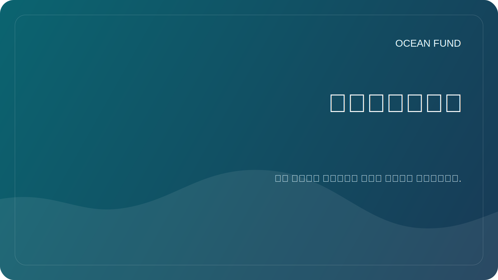

# للشركاء

صندوق المحيط مفتوح للتعاون مع الجامعات والمتاحف ومراكز الأبحاث والمنظمات غير الربحية والمؤتمرات والمجتمعات مفتوحة المصدر والمؤسسات العامة العاملة عبر المحيطات والمناخ والتنوع البيولوجي والتعليم والبيانات البحرية.

هذه الصفحة هي نقطة دخول عامة إلزامية للزوار المؤسسيين. يجب أن يؤدي التواصل مع الشركاء الخارجيين هنا أولاً، قبل المستندات الأعمق أو المحادثات الداخلية أو خطوات التعاون المتعقبة.

## ابدأ هنا

إذا كنت تمثل مؤسسة وترغب في استكشاف التعاون، فابدأ بالمعلومات العامة فقط:

- من هي مؤسستك؟
- سبب أهمية التعاون؛
- ما هي النتائج التي يمكن أن تواجه الجمهور؟
- ما هو الشكل المنطقي للخطوة الأولى.

التنسيقات الأولى الجيدة:

- محاضرة مفتوحة أو ندوة.
- موجز بحث مشترك؛
- مراجعة البيانات أو رسم خرائط مجموعة البيانات؛
- مواد المعرض أو التعليم؛
- ورشة عمل أو لجنة أو جلسة مؤتمر.

## ما يجب استخدامه في هذا المستودع

- Use [شريك صفحة واحدة](partner-one-pager.md) when you need a compact external brief.
- Use [مؤتمر / معرض صفحة واحدة](conference-exhibition-one-pager.md) for event-facing outreach.
- Read [نسخة المهمة العامة](mission-copy.md) for the approved project description.
- Read [الشراكات](../../docs/ar/partners.md) for the collaboration frame.
- Browse [مواد التوعية](../../outreach/README.md) for current communication templates.
- إذا تم تمكين مناقشات GitHub، استخدم فئة المناقشة `Partnerships` للاستكشاف العام.
- إذا كان الإجراء المتعقب واضحًا بالفعل، فافتح قالب المشكلة `Partner lead`.

## قواعد الدعاية

- لا تنشر أرقام هواتف شخصية أو عناوين بريد إلكتروني شخصية أو مستندات خاصة أو شروط مالية.
- لا تصف الشراكات بأنها مؤكدة حتى تتم الموافقة عليها رسميًا.
- اجعل المحادثات المبكرة واقعية وآمنة للعامة ومحددة.

## حالة الاتصال العامة الحالية

لا يزال هذا المستودع يحتوي على عناصر نائبة في بعض المواد العامة. لا يتم استبدال تفاصيل الاتصال إلا بعد الموافقة الرسمية.

## المسار الخارجي المطلوب

الحد الأدنى من المسار الخارجي الصحيح لجهة اتصال مؤسسية جديدة هو:

1. هذه الصفحة؛
2. [شريك صفحة واحدة](partner-one-pager.md);
3. [نسخة المهمة العامة](mission-copy.md);
4. [الشراكات](../../docs/ar/partners.md);
5. مناقشة عامة أو تتبع الخطوة التالية.
