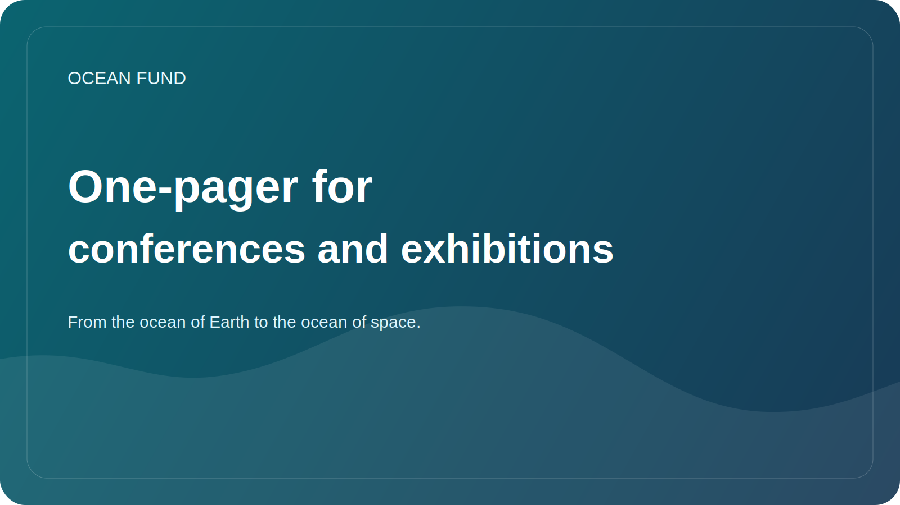

# Conference / Exhibition One-Pager

This page is a compact public brief for conference organizers, forum teams, exhibition curators, science festivals, museums, and event partners.

## Ocean Fund

Ocean Fund is an open project hub for ocean, climate, biodiversity, marine data, education, and international partnerships.

> From the ocean of Earth to the ocean of space.

## Why Ocean Fund Fits Events

Ocean Fund is designed for public-facing formats. The project translates ocean science, data, education, and long-horizon exploration into formats that can work on stage, in panels, in workshops, in exhibition spaces, and in cross-sector conversations.

## What We Can Bring

- a strong public narrative connecting ocean, climate, biodiversity, data, and exploration;
- science-based framing without inflated claims;
- open-source and public-ready materials;
- event formats that can scale from short talks to exhibition modules;
- a bridge between ocean science, satellite observation, public education, and the ocean-to-space imagination.

## Relevant Themes

- ocean science and biodiversity;
- climate and coastal resilience;
- marine data and Earth observation;
- open science and reproducible public knowledge;
- ocean education and literacy;
- museums, exhibitions, and public communication;
- blue technology and innovation;
- Earth as an ocean world and space-facing science narratives.

## Participation Formats

- keynote or invited talk;
- panel contribution;
- workshop or data session;
- public lecture;
- exhibition or booth concept;
- museum or planetarium education format;
- side event or partner conversation.

## Good First Event Concepts

- Ocean Fund: open infrastructure for ocean research, data, education, and public engagement;
- From the ocean of Earth to the ocean of space;
- Open ocean data for public understanding and education;
- Earth as an ocean world;
- Deep ocean, deep uncertainty, and public science;
- Ocean literacy through data, maps, and visualization.

## What Organizers Can Expect

- a concise and reusable public description;
- collaboration-ready copy for websites and programmes;
- small, concrete first steps instead of vague positioning;
- public-safe coordination routes through GitHub documents and discussion formats.

## Public-Safe First Step

Start with public information only:

- event name and format;
- theme and target audience;
- what role makes sense: speaker, panelist, workshop host, exhibitor, partner;
- what public result is expected.

## Recommended Public Route

1. Read [For Partners](partners.md).
2. Read [Partner One-Pager](partner-one-pager.md).
3. Read [Public Mission Copy](mission-copy.md).
4. Review [Conference Application Template](../outreach/conference-application-template.md).
5. Move to public discussion or a tracked next step.

## Publicity Rules

- no unconfirmed partnerships or speakers;
- no private contacts in public threads;
- no financial terms in public discussions;
- no overstated claims about reach, status, or completed work;
- no private event negotiations in public issues.

## Reuse

This one-pager is the recommended public attachment or link for:

- conference applications;
- exhibition applications;
- forum outreach;
- event partnership emails;
- speaker and panel introductions;
- museum and festival first-contact materials.
