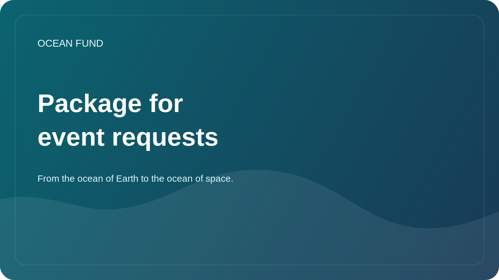

# Event Application Pack

This page is a ready-to-use public pack for conference applications, exhibition forms, event outreach, and organizer communication.

Use it together with:

- [Conference / Exhibition One-Pager](conference-exhibition-one-pager.md)
- [Public Mission Copy](mission-copy.md)

## Short Bio

Ocean Fund is an open project hub for ocean, climate, biodiversity, marine data, education, and international partnerships. The project builds a public research, education, and technology infrastructure that connects ocean science, Earth observation, public knowledge, and the ocean-to-space imagination.

## Medium Bio

Ocean Fund develops open research, education, data, and partnership infrastructure for ocean-related work. The project brings together marine science, biodiversity, climate, satellite observation, public communication, and reusable public materials in one collaboration-ready environment. Its public framing connects the ocean of Earth with the ocean of space, helping translate science and data into understandable formats for institutions, events, and broader audiences.

## Extended Bio

Ocean Fund is building a public-facing infrastructure for ocean research, data, education, public engagement, and international collaboration. The project is designed as an open hub where institutions, researchers, museums, developers, nonprofits, and event partners can connect around verified knowledge, public-safe materials, and concrete collaboration formats. Its narrative frame, from the ocean of Earth to the ocean of space, helps connect marine science, Earth observation, biodiversity, climate, education, and long-horizon exploration in a way that is rigorous, legible, and useful for public audiences.

## Abstract Option 1: General Project Introduction

Ocean Fund is building an open public infrastructure for ocean research, marine data, education, and cross-sector collaboration. This session introduces the project as a structured public hub rather than a loose collection of materials, showing how mission language, data sources, research directions, partnership formats, and GitHub-based workflows can support a serious ocean-impact initiative. The talk is relevant to audiences interested in ocean science, biodiversity, climate, education, open knowledge, and public-interest technology.

## Abstract Option 2: Ocean Data and Public Understanding

Ocean science increasingly depends on open data, Earth observation, and clear public interpretation. This session explores how Ocean Fund structures open marine data, research questions, and public-facing materials so that scientists, educators, developers, and institutions can work from a shared base. It focuses on practical translation: how to move from datasets and technical sources to understandable, reusable, and collaboration-ready public outputs without overstating claims or losing scientific care.

## Abstract Option 3: Ocean to Space Narrative

From the ocean of Earth to the ocean of space is more than a slogan. It is a framework for connecting marine science, satellite observation, ocean literacy, and long-horizon exploration in one public story. This session presents Ocean Fund as a platform that links ocean ecosystems, climate, biodiversity, data, and the imagination of space as the next ocean of exploration. It is designed for events that want a science-based narrative capable of speaking to researchers, museums, education programmes, public audiences, and cross-disciplinary partners.

## Five Talk Titles

- Ocean Fund: Open Infrastructure for Ocean Research, Data, Education, and Public Engagement
- From the Ocean of Earth to the Ocean of Space
- Open Ocean Data for Public Understanding and Collaboration
- Earth as an Ocean World
- Building Public Ocean Infrastructure Without Hype

## Organizer Email Template

Subject: Possible contribution from Ocean Fund to [Event Name]

Hello,

I am reaching out on behalf of Ocean Fund, an open project hub focused on ocean, climate, biodiversity, marine data, education, and international partnerships.

We believe there may be a strong fit between Ocean Fund and [Event Name], especially around themes such as ocean science, public engagement, marine data, education, biodiversity, climate, exhibitions, and cross-sector dialogue.

We can contribute in several formats, depending on what is useful for your programme:

- talk or keynote;
- panel contribution;
- workshop or data session;
- exhibition or education concept;
- side event or partner-facing conversation.

Useful starting materials:

- [Conference / Exhibition One-Pager](conference-exhibition-one-pager.md)
- [Public Mission Copy](mission-copy.md)

If relevant, we would be glad to explore a small first step and see whether there is a good match with your current agenda.

Best regards,
Ocean Fund
`partners@example.org`

Before sending, replace placeholders and use only confirmed public contact information.

## Usage Notes

- Use the short bio when the form is tight.
- Use the medium bio for speaker, partner, or exhibitor profiles.
- Use the extended bio when the organizer requests full project context.
- Choose the abstract that best matches the event theme rather than forcing one universal version.
- Adjust the organizer email only after checking the event audience, format, and word limits.
