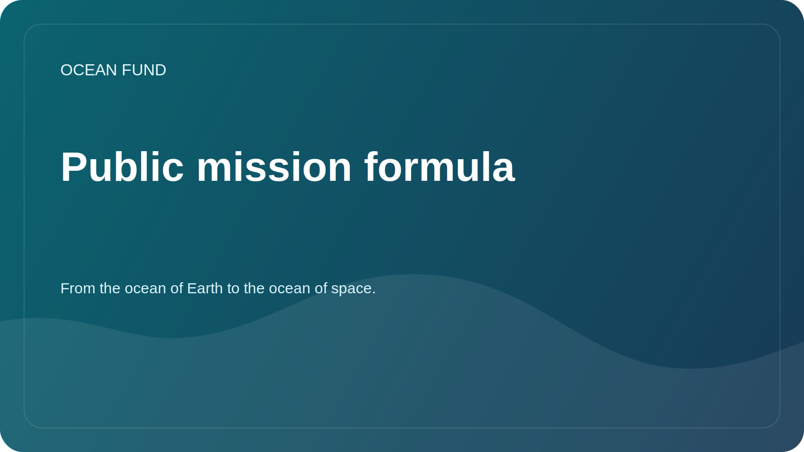

# Public Mission Copy

This page is a required public-facing layer of Ocean Fund. It exists so that partners, media, contributors, and institutions can reuse a consistent project description without guessing how the fund should be presented.

## Core Formula

Russian:

> From the ocean of Earth to the ocean of space.

English:

> From the ocean of Earth to the ocean of space.

## Short Copy

Russian:

The Ocean Foundation builds open research, education and technology infrastructure for the ocean, climate, biodiversity, marine data and international partnerships.

English:

Ocean Fund builds open research, education, and technology infrastructure for ocean, climate, biodiversity, marine data, and international partnerships.

## Medium Copy

Russian:

The Ocean Foundation brings together research, education, marine data, satellite observations and international collaboration around the goals of understanding and protecting the ocean. The project is building a public infrastructure through which scientists, museums, universities, NGOs, developers and partner organizations can connect to collaborate.

English:

Ocean Fund connects research, education, marine data, Earth observation, and international collaboration around the work of understanding and protecting the ocean. The project builds a public infrastructure through which researchers, museums, universities, nonprofits, developers, and partner organizations can join shared work.

## Extended Copy

Russian:

The Ocean Foundation develops an open platform for ocean-related research, education, data, visualization and international partnerships. Important to the project is the connection between Earth's oceans, satellite observations, public knowledge and the image of space as the next ocean of exploration. This logic helps connect ocean science, the climate agenda, biodiversity, digital tools, education and long-term imagination into one understandable public system.

English:

Ocean Fund develops an open platform for research, education, data, visualization, and international partnerships related to the ocean. The project deliberately links the ocean of Earth with Earth observation, public knowledge, and the imagination of space as the next ocean of exploration. This framing helps connect ocean science, climate work, biodiversity, digital tools, education, and long-horizon public imagination within one coherent public system.

## Usage Rule

Use this page as the primary source for public descriptions in:

- GitHub profile and repository copy;
- partnership outreach;
- discussions and issue templates;
- presentation intros;
- conference, exhibition, and forum applications;
- first-contact materials for institutions.

When in doubt, use the short or medium version rather than improvising a new description.
