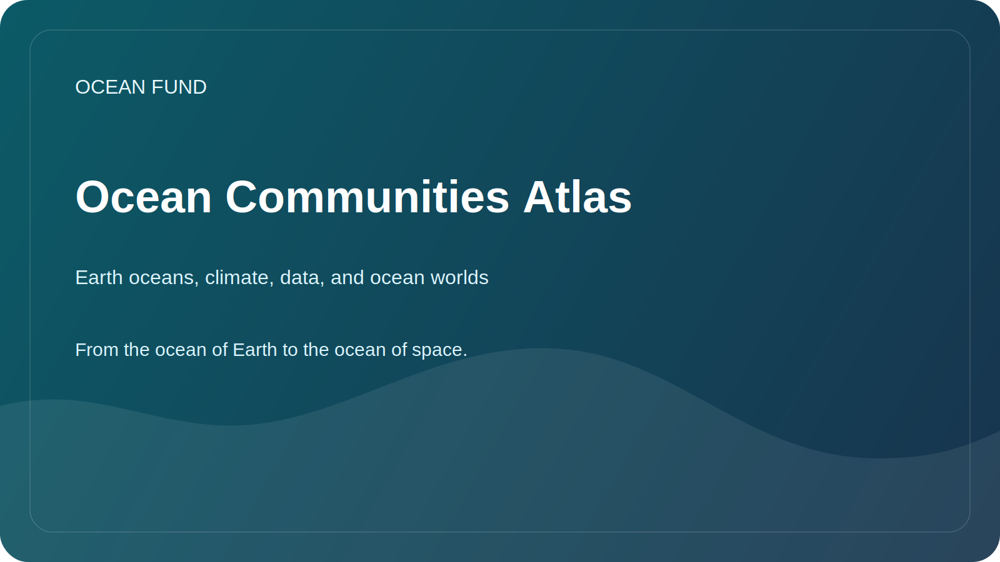

# Ocean Communities Atlas

This page maps the communities Ocean Fund should watch, learn from, and eventually enter across Earth oceans, climate systems, marine data, and ocean worlds in space.

Verified against official sites on 12 May 2026.

## Focus

- Earth oceans: Ocean Decade, GenOcean, GOOS, OBIS, Copernicus Marine, EMODnet.
- Public-action networks: Ocean Conservancy, Oceana, Surfrider, Mission Blue, Reef Check, Coral Reef Alliance, Oceanic Society.
- Planetary and ocean-world communities: NASA Ocean Worlds, NASA Astrobiology, Moon to Mars, LEAG, Mars Exploration Program, VEXAG, MExAG, OPAG, Europa Clipper.

## Practical Entry Paths

- track newsletters, mailing lists, public meetings, and open resource pages;
- convert each target community into a partner card, source card, and next-step issue;
- bridge Earth-ocean communities and ocean-world communities through public language, data pages, and event packs.

## Working Rule

Watching, learning from, or mapping a community is not the same as a formal partnership.
