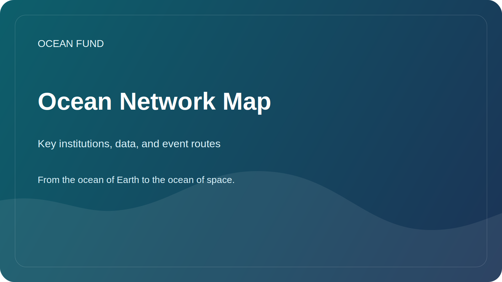

# Ocean Network Map

This page is a compact public map of key institutions, open data infrastructures, and recurring event routes that shape the global ocean ecosystem around Ocean Fund.

Verified against official sites on 12 May 2026.

## Why This Page Exists

Ocean work is distributed across international coordination bodies, open data systems, civil-society organizations, and recurring conferences. Ocean Fund needs a practical public map of who does what and where the project can plug in next.

## Global Science and Coordination

- [Ocean Decade](https://oceandecade.org/) coordinates the UN Decade of Ocean Science for Sustainable Development and provides a global frame for programs, actions, and public engagement.
- [GOOS](https://goosocean.org/what-we-do/) coordinates sustained global ocean observation and helps connect measurements, forecasting, and operational services.
- [OBIS](https://obis.org/about/) is a major open infrastructure for marine biodiversity data and species occurrence records.

## Open Data and Operational Infrastructure

- [Copernicus Marine](https://marine.copernicus.eu/about) provides open marine data, forecasting, and state-of-the-ocean services.
- [EMODnet](https://emodnet.ec.europa.eu/en/about-emodnet) brings together interoperable European marine data across multiple thematic domains.

## Public Action and Civic Engagement

- [Ocean Conservancy](https://oceanconservancy.org/) is a major public-interest ocean organization working across science, policy, and community action.
- [GenOcean](https://oceandecade.org/genocean/) is the Ocean Decade campaign focused on broad public mobilization and citizen participation.

## Major Event Routes

- [UN Ocean Conference](https://sdgs.un.org/conferences/ocean2025/about-unoc-2025): the last conference was held in Nice on 9-13 June 2025.
- [Our Ocean Conference](https://www.ouroceanconference.org/conferences/mombasa-2026/): the next confirmed edition is scheduled for Mombasa-Kilifi on 16-18 June 2026.
- [Ocean Sciences Meeting](https://www.agu.org/ocean-sciences-meeting/about): the 2026 meeting was held in Glasgow on 22-27 February 2026.
- [Oceanology International](https://www.oceanologyinternational.com/london/en-gb/about.html): the next London edition is scheduled for 10-12 March 2026.
- [Ocean Business](https://www.oceanbusiness.com/): the next confirmed edition is scheduled for Southampton on 6-8 April 2027.

## Practical Entry Paths for Ocean Fund

- publish multilingual public briefs and issue-driven one-pagers;
- track speaker calls, side events, exhibition opportunities, and public discussions;
- convert each target organization or event into a partner card, event card, and next-step issue;
- approach data infrastructures and public-science networks through reusable public materials rather than ad hoc messaging.

## Working Rule

Use official sites as the first reference layer. Recheck dates, statuses, and participation formats before any public claim or outbound message.
