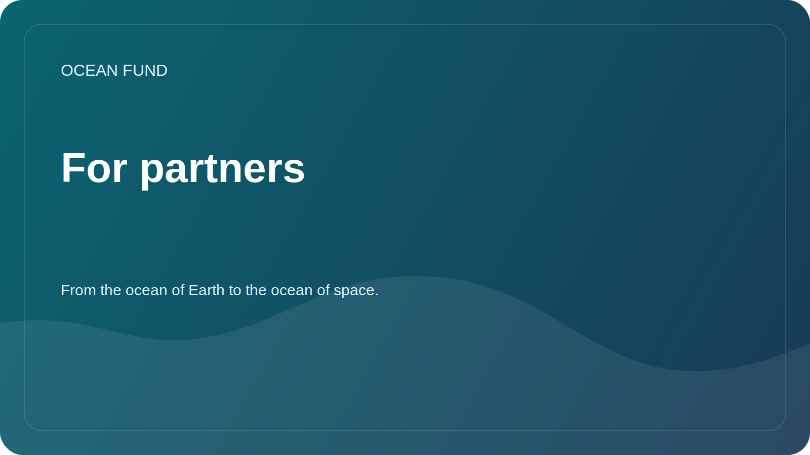

# For Partners

Ocean Fund is open to collaboration with universities, museums, research centers, nonprofits, conferences, open-source communities, and public institutions working across ocean, climate, biodiversity, education, and marine data.

This page is a mandatory public entry point for institutional visitors. External partner outreach should lead here first, before deeper documents, internal conversations, or tracked collaboration steps.

## Start Here

If you represent an organization and want to explore collaboration, begin with public information only:

- who your organization is;
- why the collaboration is relevant;
- what public-facing outcome could exist;
- what format makes sense for a first step.

Good first formats:

- open lecture or seminar;
- joint research brief;
- data review or dataset mapping;
- exhibition or education material;
- workshop, panel, or conference session.

## What To Use In This Repository

- Use [Partner One-Pager](partner-one-pager.md) when you need a compact external brief.
- Use [Conference / Exhibition One-Pager](conference-exhibition-one-pager.md) for event-facing outreach.
- Read [Public Mission Copy](mission-copy.md) for the approved project description.
- Read [Partnerships](../docs/partners.md) for the collaboration frame.
- Browse [Outreach Materials](../outreach/README.md) for current communication templates.
- If GitHub Discussions is enabled, use the `Partnerships` discussion category for public exploration.
- If a tracked action is already clear, open the `Partner lead` issue template.

## Publicity Rules

- Do not post personal phone numbers, personal email addresses, private documents, or financial terms.
- Do not describe partnerships as confirmed until they are formally approved.
- Keep early conversations factual, public-safe, and specific.

## Current Public Contact State

This repository still contains placeholders in some public-facing materials. Replace contact details only after official approval.

## Required External Path

The minimum correct external route for a new institutional contact is:

1. this page;
2. [Partner One-Pager](partner-one-pager.md);
3. [Public Mission Copy](mission-copy.md);
4. [Partnerships](../docs/partners.md);
5. public discussion or tracked next step.
