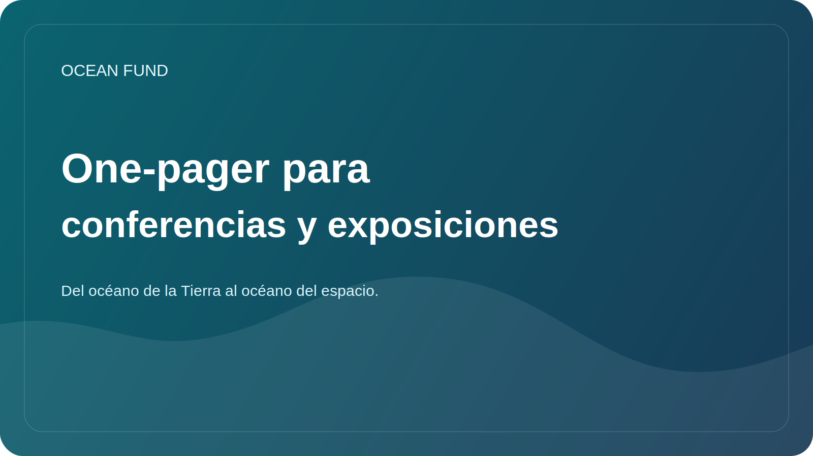

# Conferencia / Exposición de una página

Esta página es un resumen público compacto para organizadores de conferencias, equipos de foros, curadores de exposiciones, festivales científicos, museos y socios de eventos.

## Fondo Oceánico

Ocean Fund es un centro de proyectos abierto para océanos, clima, biodiversidad, datos marinos, educación y asociaciones internacionales.

> Del océano de la Tierra al océano del espacio.

## Por qué Ocean Fund se adapta a los eventos

Ocean Fund está diseñado para formatos públicos. El proyecto traduce las ciencias oceánicas, los datos, la educación y la exploración a largo plazo en formatos que pueden funcionar en el escenario, en paneles, en talleres, en espacios de exhibición y en conversaciones intersectoriales.

## Lo que podemos traer

- una narrativa pública sólida que conecte el océano, el clima, la biodiversidad, los datos y la exploración;
- un marco basado en la ciencia sin afirmaciones infladas;
- materiales de código abierto y listos para el público;
- formatos de eventos que pueden escalar desde charlas cortas hasta módulos de exposición;
- un puente entre las ciencias oceánicas, la observación satelital, la educación pública y la imaginación del océano al espacio.

## Temas relevantes

- ciencias oceánicas y biodiversidad;
- resiliencia climática y costera;
- datos marinos y observación de la Tierra;
- ciencia abierta y conocimiento público reproducible;
- educación y alfabetización sobre los océanos;
- museos, exposiciones y comunicación pública;
- tecnología azul e innovación;
- La Tierra como mundo oceánico y narrativas científicas orientadas al espacio.

## Formatos de participación

- charla magistral o invitada;
- contribución del panel;
- taller o sesión de datos;
- conferencia pública;
- concepto de exposición o stand;
- formato educativo de museo o planetario;
- evento paralelo o conversación en pareja.

## Buenos conceptos para el primer evento

- Fondo Oceánico: infraestructura abierta para la investigación, los datos, la educación y la participación pública de los océanos;
- Del océano de la Tierra al océano del espacio;
- Datos de océano abierto para la comprensión y la educación del público;
- La Tierra como mundo oceánico;
- Océano profundo, incertidumbre profunda y ciencia pública;
- Alfabetización oceánica a través de datos, mapas y visualización.

## Lo que pueden esperar los organizadores

- una descripción pública concisa y reutilizable;
- copia lista para colaborar para sitios web y programas;
- primeros pasos pequeños y concretos en lugar de un posicionamiento vago;
- rutas de coordinación seguras para el público a través de documentos de GitHub y formatos de discusión.

## Primer paso para la seguridad pública

Comience solo con información pública:

- nombre y formato del evento;
- tema y público objetivo;
- qué rol tiene sentido: orador, panelista, anfitrión del taller, expositor, socio;
- qué resultado público se espera.

## Ruta pública recomendada

1. Read [Para socios](partners.md).
2. Read [Socio de una página](partner-one-pager.md).
3. Read [Copia de la misión pública](mission-copy.md).
4. Review [Plantilla de solicitud de conferencia](../outreach/conference-application-template.md).
5. Pasar a la discusión pública o al seguimiento del siguiente paso.

## Reglas de publicidad

- sin asociaciones ni oradores no confirmados;
- no hay contactos privados en hilos públicos;
- no hay condiciones financieras en las discusiones públicas;
- sin afirmaciones exageradas sobre alcance, estado o trabajo completado;
- No hay negociaciones de eventos privados en temas públicos.

## Reutilizar

Esta página es el archivo adjunto o enlace público recomendado para:

- aplicaciones de conferencias;
- aplicaciones de exhibición;
- extensión del foro;
- correos electrónicos de socios de eventos;
- presentaciones de oradores y paneles;
- Materiales de primer contacto para museos y festivales.
