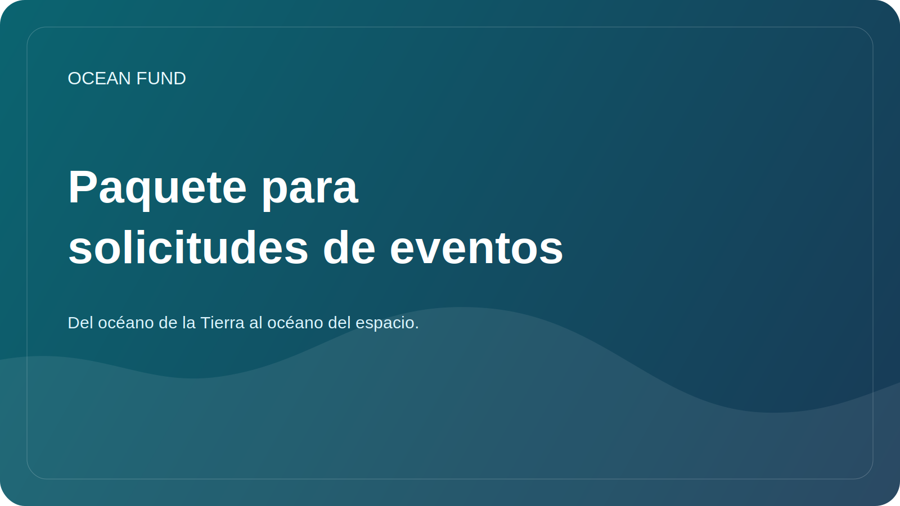

# Paquete de aplicación para eventos

Esta página es un paquete público listo para usar para solicitudes de conferencias, formularios de exhibición, divulgación de eventos y comunicación de organizadores.

Úselo junto con:

- [Conferencia / Exposición de una página](conference-exhibition-one-pager.md)
- [Copia de la misión pública](mission-copy.md)

## Breve biografía

Ocean Fund es un centro de proyectos abierto para océanos, clima, biodiversidad, datos marinos, educación y asociaciones internacionales. El proyecto construye una infraestructura pública de investigación, educación y tecnología que conecta las ciencias oceánicas, la observación de la Tierra, el conocimiento público y la imaginación del océano al espacio.

## Biografía mediana

Ocean Fund desarrolla infraestructura abierta de investigación, educación, datos y asociaciones para el trabajo relacionado con los océanos. El proyecto reúne ciencia marina, biodiversidad, clima, observación satelital, comunicación pública y materiales públicos reutilizables en un entorno listo para la colaboración. Su marco público conecta el océano de la Tierra con el océano del espacio, ayudando a traducir la ciencia y los datos a formatos comprensibles para instituciones, eventos y audiencias más amplias.

## Biografía ampliada

Ocean Fund está construyendo una infraestructura pública para la investigación, los datos, la educación, la participación pública y la colaboración internacional de los océanos. El proyecto está diseñado como un centro abierto donde instituciones, investigadores, museos, desarrolladores, organizaciones sin fines de lucro y socios de eventos pueden conectarse en torno a conocimientos verificados, materiales seguros para el público y formatos de colaboración concretos. Su marco narrativo, desde el océano de la Tierra hasta el océano del espacio, ayuda a conectar las ciencias marinas, la observación de la Tierra, la biodiversidad, el clima, la educación y la exploración a largo plazo de una manera rigurosa, legible y útil para el público.

## Opción de resumen 1: Introducción general al proyecto

Ocean Fund está construyendo una infraestructura pública abierta para la investigación oceánica, datos marinos, educación y colaboración intersectorial. Esta sesión presenta el proyecto como un centro público estructurado en lugar de una colección suelta de materiales, mostrando cómo el lenguaje de la misión, las fuentes de datos, las direcciones de investigación, los formatos de asociación y los flujos de trabajo basados ​​en GitHub pueden respaldar una iniciativa seria de impacto en los océanos. La charla es relevante para audiencias interesadas en las ciencias oceánicas, la biodiversidad, el clima, la educación, el conocimiento abierto y la tecnología de interés público.

## Opción abstracta 2: datos oceánicos y comprensión pública

Las ciencias oceánicas dependen cada vez más de datos abiertos, observación de la Tierra y una interpretación pública clara. Esta sesión explora cómo Ocean Fund estructura datos marinos abiertos, preguntas de investigación y materiales de cara al público para que los científicos, educadores, desarrolladores e instituciones puedan trabajar desde una base compartida. Se centra en la traducción práctica: cómo pasar de conjuntos de datos y fuentes técnicas a resultados públicos comprensibles, reutilizables y listos para la colaboración sin exagerar las afirmaciones ni perder el cuidado científico.

## Opción abstracta 3: Narrativa del océano al espacio

Del océano de la Tierra al océano del espacio es más que un eslogan. Es un marco para conectar las ciencias marinas, la observación satelital, la alfabetización oceánica y la exploración a largo plazo en una sola historia pública. Esta sesión presenta Ocean Fund como una plataforma que vincula los ecosistemas oceánicos, el clima, la biodiversidad, los datos y la imaginación del espacio como el próximo océano de exploración. Está diseñado para eventos que desean una narrativa basada en la ciencia capaz de dirigirse a investigadores, museos, programas educativos, audiencias públicas y socios interdisciplinarios.

## Cinco títulos de charlas

- Fondo Oceánico: Infraestructura abierta para la investigación, los datos, la educación y la participación pública de los océanos
- Del océano de la Tierra al océano del espacio
- Datos de océano abierto para la comprensión y la colaboración públicas
- La Tierra como un mundo oceánico
- Construyendo infraestructura oceánica pública sin exageraciones

## Plantilla de correo electrónico del organizador

Asunto: Posible contribución de Ocean Fund a [Nombre del evento]

Hola,

Me comunico en nombre de Ocean Fund, un centro de proyectos abiertos centrado en los océanos, el clima, la biodiversidad, los datos marinos, la educación y las asociaciones internacionales.

Creemos que puede haber una fuerte coincidencia entre Ocean Fund y [Nombre del evento], especialmente en torno a temas como ciencias oceánicas, participación pública, datos marinos, educación, biodiversidad, clima, exposiciones y diálogo intersectorial.

Podemos contribuir en varios formatos, dependiendo de lo que sea útil para su programa:

- charla o discurso de apertura;
- contribución del panel;
- taller o sesión de datos;
- concepto de exposición o educación;
- evento paralelo o conversación con la pareja.

Materiales de partida útiles:

- [Conferencia / Exposición de una página](conference-exhibition-one-pager.md)
- [Copia de la misión pública](mission-copy.md)

Si es relevante, estaremos encantados de explorar un pequeño primer paso y ver si coincide con su agenda actual.

Atentamente,
Fondo Oceánico
__CÓDIGO0__

Antes de enviar, reemplace los marcadores de posición y utilice únicamente información de contacto pública confirmada.

## Notas de uso

- Utilice la biografía breve cuando el formulario sea ajustado.
- Utilice la biografía mediana para perfiles de oradores, socios o expositores.
- Utilice la biografía ampliada cuando el organizador solicite el contexto completo del proyecto.
- Elija el resumen que mejor se adapte al tema del evento en lugar de forzar una versión universal.
- Ajuste el correo electrónico del organizador solo después de verificar la audiencia, el formato y los límites de palabras del evento.
