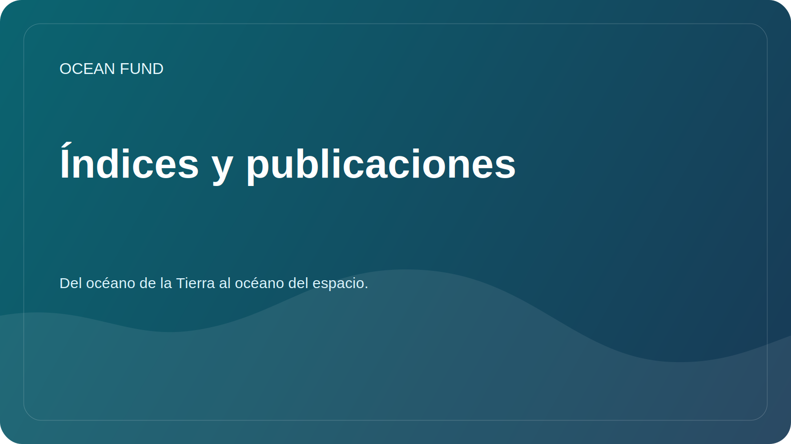

# Índices y publicaciones de una página

Esta página explica cómo Ocean Fund trata los índices, ensayos, publicaciones, atlas y resúmenes públicos como parte de un sistema de conocimiento vivo.

## Por qué existe esta capa

El trabajo oceánico se fragmenta fácilmente. Las notas de investigación se encuentran en un lugar, los ensayos en otro, las explicaciones públicas en otro lugar y los índices de datos en sistemas separados. Ocean Fund está construyendo una estructura en la que índices, publicaciones, mapas de datos, materiales de eventos y textos de asociaciones se refuerzan entre sí en lugar de separarse.

## Qué queremos decir con índices

Para Ocean Fund, un índice puede incluir:

- mapas de fuentes de datos;
- registros de conjuntos de datos;
- atlas organizacionales;
- inventarios de temas;
- colas de publicaciones y ensayos;
- paquetes de eventos y divulgación;
- resúmenes verificados de sistemas de conocimiento internos o externos.

## Lo que publicamos

- resúmenes seguros para el público;
- lenguaje reutilizable de misión y eventos;
- resúmenes orientados a la investigación;
- registros de datos y fuentes;
- folletos informativos para socios y eventos;
- materiales educativos y de comunicación.
- capas de artículos y ensayos multilingües en los seis idiomas oficiales de la ONU.

## Lo que no publicamos

- documentos privados;
- contactos personales;
- reclamaciones no verificadas;
- exportaciones internas sin procesar con identificadores;
- Detalles financieros o legales no aprobados para su divulgación pública.

## Por qué esto es importante para Ocean Fund

Esta capa permite que el proyecto se conecte:

- ciencias oceánicas;
- datos marinos y satelitales;
- educación pública;
- conferencias y exposiciones;
- asociaciones y colaboración intersectorial;
- el puente entre el océano de la Tierra y el océano del espacio.

## Reutilizar

Esta página es útil para explicar que Ocean Fund no solo está creando contenido, sino también construyendo la estructura de índice que permite que el contenido circule a través de la investigación, la educación, los eventos y la colaboración pública.
