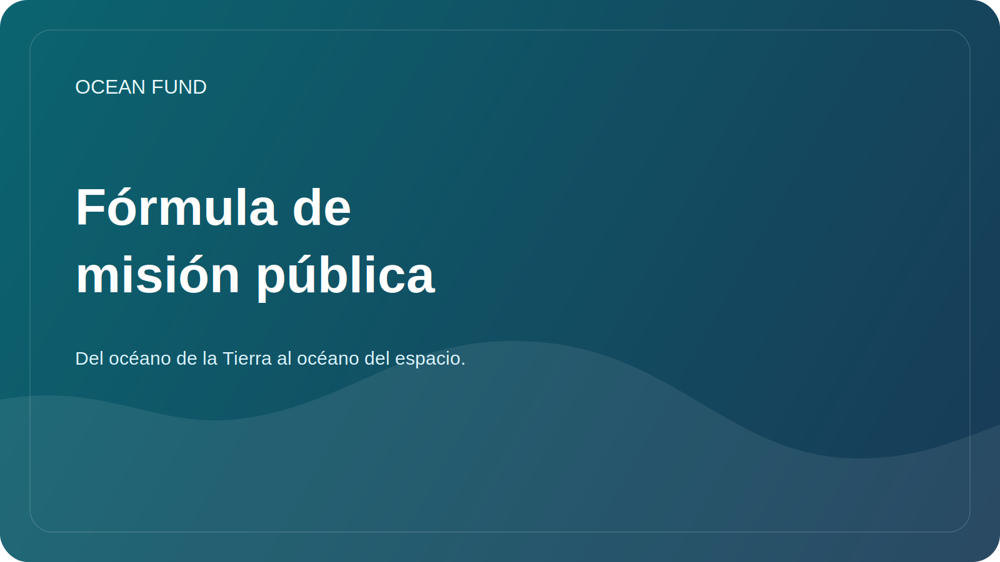

# Copia de la misión pública

Esta página es una capa pública obligatoria de Ocean Fund. Existe para que los socios, los medios, los contribuyentes y las instituciones puedan reutilizar una descripción coherente del proyecto sin tener que adivinar cómo debe presentarse el fondo.

## Fórmula central

Ruso:

> Del océano de la Tierra al océano del espacio.

Inglés:

> Del océano de la Tierra al océano del espacio.

## Copia corta

Ruso:

La Ocean Foundation construye infraestructura abierta de investigación, educación y tecnología para el océano, el clima, la biodiversidad, los datos marinos y las asociaciones internacionales.

Inglés:

Ocean Fund construye infraestructura abierta de investigación, educación y tecnología para los océanos, el clima, la biodiversidad, los datos marinos y las asociaciones internacionales.

## Copia mediana

Ruso:

La Ocean Foundation reúne investigación, educación, datos marinos, observaciones satelitales y colaboración internacional en torno a los objetivos de comprender y proteger el océano. El proyecto está construyendo una infraestructura pública a través de la cual científicos, museos, universidades, ONG, desarrolladores y organizaciones asociadas puedan conectarse para colaborar.

Inglés:

Ocean Fund conecta la investigación, la educación, los datos marinos, la observación de la Tierra y la colaboración internacional en torno al trabajo de comprender y proteger el océano. El proyecto construye una infraestructura pública a través de la cual investigadores, museos, universidades, organizaciones sin fines de lucro, desarrolladores y organizaciones asociadas pueden unirse al trabajo compartido.

## Copia extendida

Ruso:

La Ocean Foundation desarrolla una plataforma abierta para investigación, educación, datos, visualización y asociaciones internacionales relacionadas con los océanos. Para el proyecto es importante la conexión entre los océanos de la Tierra, las observaciones satelitales, el conocimiento público y la imagen del espacio como el próximo océano de exploración. Esta lógica ayuda a conectar las ciencias oceánicas, la agenda climática, la biodiversidad, las herramientas digitales, la educación y la imaginación a largo plazo en un sistema público comprensible.

Inglés:

Ocean Fund desarrolla una plataforma abierta para investigación, educación, datos, visualización y asociaciones internacionales relacionadas con el océano. El proyecto vincula deliberadamente el océano de la Tierra con la observación de la Tierra, el conocimiento público y la imaginación del espacio como el próximo océano de exploración. Este marco ayuda a conectar las ciencias oceánicas, el trabajo climático, la biodiversidad, las herramientas digitales, la educación y la imaginación pública a largo plazo dentro de un sistema público coherente.

## Regla de uso

Utilice esta página como fuente principal de descripciones públicas en:

- Perfil de GitHub y copia del repositorio;
- alcance de la asociación;
- debates y plantillas de temas;
- introducciones de presentación;
- aplicaciones para conferencias, exposiciones y foros;
- Materiales de primer contacto para instituciones.

En caso de duda, utilice la versión corta o mediana en lugar de improvisar una nueva descripción.
