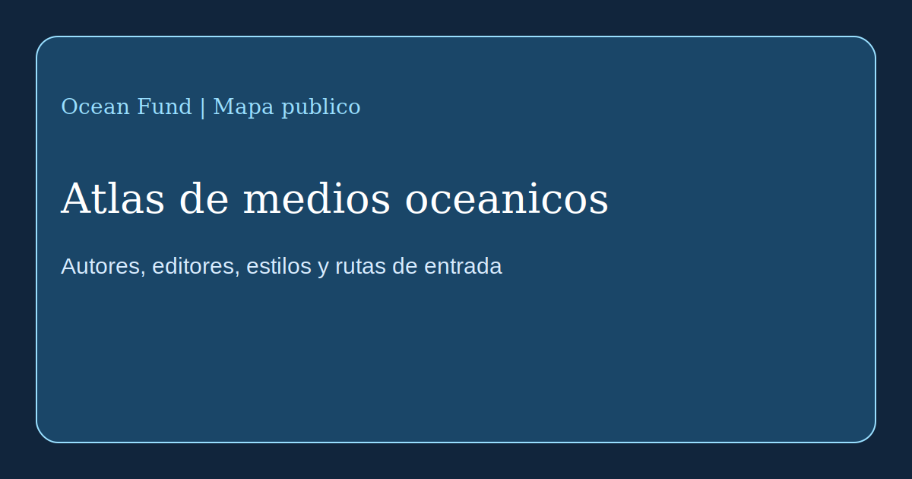

# Atlas de medios oceanicos

Esta pagina mapea un primer conjunto de medios, editores y modelos de comunicacion publica que influyen en como se escriben y circulan las historias sobre el oceano.

Verificado con paginas publicas oficiales al 13 de mayo de 2026.

## Focus

- Oceanographic Magazine: revista oceanica muy visual con energia de columnistas y expediciones.
- Hakai Magazine: modelo archivistico long-form sobre costas, ciencia, sociedad y periodismo narrativo.
- Mongabay Oceans: periodismo ambiental rapido, con fuentes y orientado a la rendicion de cuentas.
- Waterfront Alliance / City of Water Day: comunicacion civica sobre el agua y participacion urbana publica.

## Por que importa

Ocean Fund necesita entender no solo que publicar, sino como las arquitecturas editoriales vuelven legible y memorable la escritura oceanica.
