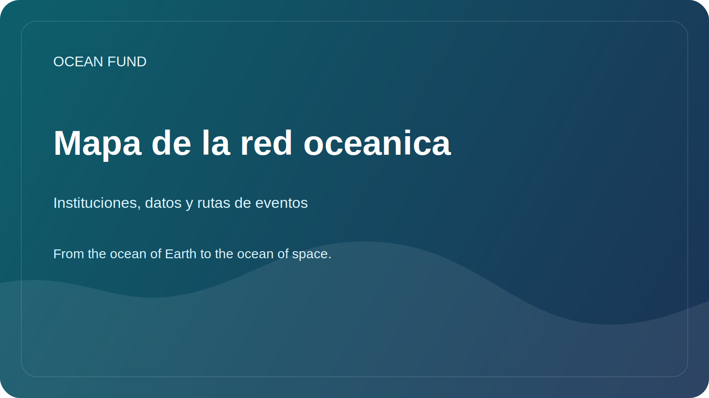

# Mapa de la red oceanica

Esta pagina es un mapa publico compacto de las instituciones clave, las infraestructuras de datos abiertos y las grandes rutas de eventos que estructuran el ecosistema oceanico global alrededor de Ocean Fund.

Verificado con sitios oficiales el 12 de mayo de 2026.

## Por Que Existe Esta Pagina

El trabajo oceanico se distribuye entre organismos internacionales de coordinacion, sistemas de datos abiertos, organizaciones de la sociedad civil y conferencias recurrentes. Ocean Fund necesita un mapa publico practico de quien hace que y de donde puede integrarse el proyecto.

## Ciencia Global y Coordinacion

- [Ocean Decade](https://oceandecade.org/) coordina el Decenio de las Ciencias Oceanicas para el Desarrollo Sostenible de la ONU y ofrece un marco global para programas, acciones y participacion publica.
- [GOOS](https://goosocean.org/what-we-do/) coordina la observacion oceanica global sostenida y conecta mediciones, pronosticos y servicios operativos.
- [OBIS](https://obis.org/about/) es una gran infraestructura abierta para datos de biodiversidad marina y registros de ocurrencia de especies.

## Datos Abiertos e Infraestructura Operativa

- [Copernicus Marine](https://marine.copernicus.eu/about) ofrece datos marinos abiertos, pronosticos y servicios sobre el estado del oceano.
- [EMODnet](https://emodnet.ec.europa.eu/en/about-emodnet) reune datos marinos europeos interoperables en multiples dominios tematicos.

## Accion Publica y Participacion Civica

- [Ocean Conservancy](https://oceanconservancy.org/) es una importante organizacion de interes publico que trabaja entre ciencia, politica y accion comunitaria.
- [GenOcean](https://oceandecade.org/genocean/) es la campana de Ocean Decade centrada en la movilizacion publica y la participacion ciudadana.

## Principales Rutas de Eventos

- [UN Ocean Conference](https://sdgs.un.org/conferences/ocean2025/about-unoc-2025): la ultima conferencia se celebro en Niza del 9 al 13 de junio de 2025.
- [Our Ocean Conference](https://www.ouroceanconference.org/conferences/mombasa-2026/): la proxima edicion confirmada esta prevista en Mombasa-Kilifi del 16 al 18 de junio de 2026.
- [Ocean Sciences Meeting](https://www.agu.org/ocean-sciences-meeting/about): la edicion de 2026 se celebro en Glasgow del 22 al 27 de febrero de 2026.
- [Oceanology International](https://www.oceanologyinternational.com/london/en-gb/about.html): la proxima edicion de Londres esta prevista del 10 al 12 de marzo de 2026.
- [Ocean Business](https://www.oceanbusiness.com/): la proxima edicion confirmada esta prevista en Southampton del 6 al 8 de abril de 2027.

## Vias de Entrada Practicas para Ocean Fund

- publicar briefs publicos multilingues y one-pagers orientados por temas;
- seguir convocatorias para ponentes, eventos paralelos, oportunidades de exhibicion y debates publicos;
- convertir cada organizacion u evento objetivo en una ficha de socio, una ficha de evento y un issue de siguiente paso;
- acercarse a infraestructuras de datos y redes de ciencia publica mediante materiales reutilizables en lugar de mensajes improvisados.

## Regla de Trabajo

Utilice los sitios oficiales como primera capa de referencia. Revise de nuevo fechas, estados y formatos de participacion antes de cualquier afirmacion publica o mensaje externo.
