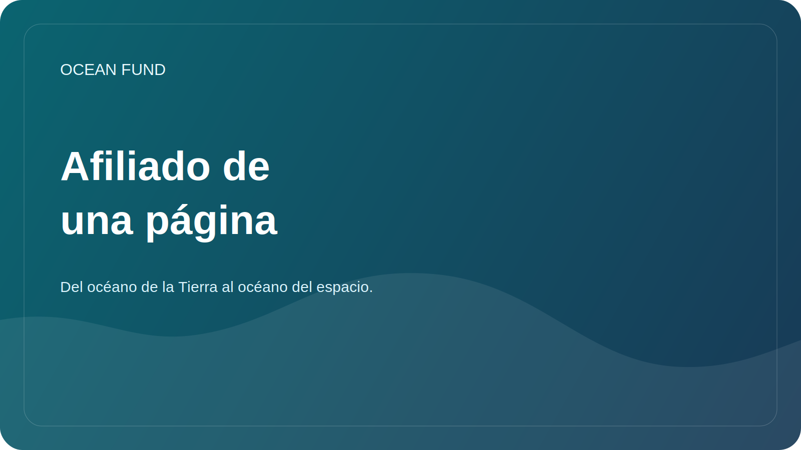

# Socio de una página

Esta página es un resumen público compacto para instituciones, foros, exposiciones, conferencias y actividades de divulgación de primer contacto.

## Fondo Oceánico

Ocean Fund es un centro de proyectos abierto para océanos, clima, biodiversidad, datos marinos, educación y asociaciones internacionales.

> Del océano de la Tierra al océano del espacio.

## Lo que estamos construyendo

Ocean Fund está construyendo una infraestructura pública de investigación, educación y tecnología en torno a la comprensión y protección de los océanos. El proyecto conecta las ciencias marinas, la observación de la Tierra, el conocimiento público y la exploración a largo plazo en un espacio de colaboración abierto.

## Por qué esto importa

El océano se encuentra en el centro de la regulación del clima, la biodiversidad, los sistemas alimentarios, la resiliencia costera, la cultura, la ciencia y la imaginación pública. Sin embargo, los datos, la educación, la investigación y las oportunidades de asociación a menudo están fragmentados. Ocean Fund existe para facilitar la conexión de estas capas de una manera pública, estructurada y lista para la colaboración.

## Lo que un socio puede esperar

- un marco claro de colaboración pública;
- una ruta de primer contacto objetiva y silenciosa;
- formatos iniciales pequeños y concretos en lugar de un lenguaje vago de asociación;
- un entorno de proyecto abierto para documentos, problemas, debates y materiales reutilizables.

## Buenos formatos de primera colaboración

- conferencia o seminario público;
- informe de investigación conjunto;
- revisión de conjuntos de datos o sprint de mapeo;
- módulo expositivo o educativo;
- taller, panel o sesión de conferencia;
- formato de ciencia pública océano-espacio.

## ¿Para quién es esto?

- universidades e institutos de investigación;
- museos, centros científicos y planetarios;
- organizaciones sin fines de lucro y fundaciones;
- conferencias, foros y exposiciones;
- comunidades de datos y código abierto;
- instituciones públicas que trabajan en los océanos, el clima, la biodiversidad o la educación.

## Primer paso para la seguridad pública

Comience solo con información pública:

- quién eres;
- por qué la colaboración es relevante;
- qué resultado público podría existir;
- Qué pequeño primer paso tiene sentido.

## Ruta de entrada pública

1. Read [Para socios](partners.md).
2. Read [Copia de la misión pública](mission-copy.md).
3. Revise [Asociaciones](../../docs/es/partners.md).
4. Utilice la categoría de discusión pública `Partnerships` o un tema rastreado para el siguiente paso.

## Reglas de publicidad

- sin documentos privados;
- sin contactos personales;
- sin términos financieros en hilos públicos;
- sin reclamaciones de asociación no confirmadas;
- sin declaraciones exageradas sobre el estado o el alcance.

## Reutilizar

Esta página es el archivo adjunto o enlace público recomendado para:

- primeros correos electrónicos de socios;
- extensión de conferencias y foros;
- aplicaciones de exhibición;
- propuestas de colaboración;
- breves presentaciones institucionales.
