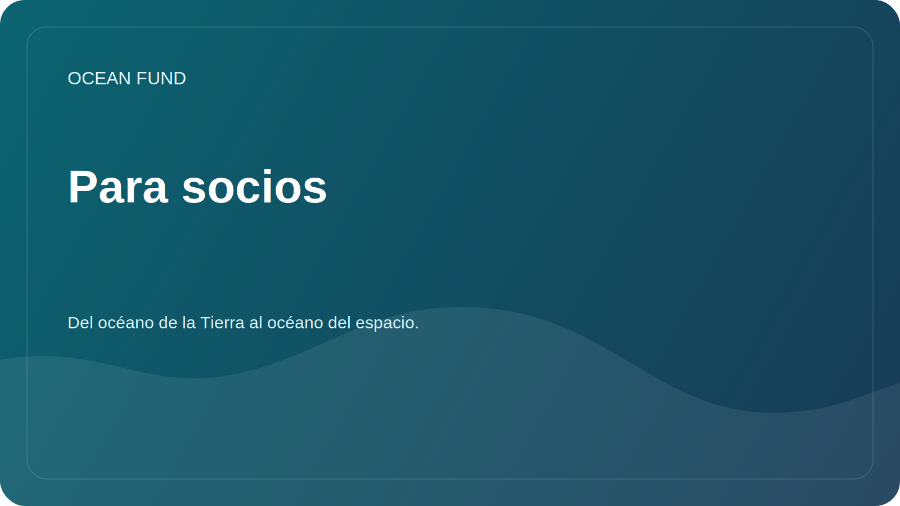

# Para socios

Ocean Fund está abierto a la colaboración con universidades, museos, centros de investigación, organizaciones sin fines de lucro, conferencias, comunidades de código abierto e instituciones públicas que trabajan en los océanos, el clima, la biodiversidad, la educación y los datos marinos.

Esta página es un punto de entrada público obligatorio para visitantes institucionales. La divulgación de los socios externos debe conducir aquí primero, antes de documentos más profundos, conversaciones internas o pasos de colaboración rastreados.

## Comience aquí

Si representa a una organización y desea explorar la colaboración, comience solo con información pública:

- quién es su organización;
- por qué la colaboración es relevante;
- qué resultado público podría existir;
- qué formato tiene sentido para un primer paso.

Buenos primeros formatos:

- conferencia o seminario abierto;
- informe de investigación conjunto;
- revisión de datos o mapeo de conjuntos de datos;
- material de exhibición o educativo;
- taller, panel o sesión de conferencia.

## Qué usar en este repositorio

- Utilice [Socio de una página](partner-one-pager.md) cuando necesite un informe externo compacto.
- Use [Conferencia / Exposición de una página](conference-exhibition-one-pager.md) for event-facing outreach.
- Read [Copia de la misión pública](mission-copy.md) for the approved project description.
- Lea [Asociaciones](../docs/partners.md) para conocer el marco de colaboración.
- Explore [Materiales de divulgación](../outreach/README.md) para ver las plantillas de comunicación actuales.
- Si las Discusiones de GitHub están habilitadas, use la categoría de discusión `Partnerships` para la exploración pública.
- Si una acción rastreada ya está clara, abra la plantilla de problema `Partner lead`.

## Reglas de publicidad

- No publique números de teléfono personales, direcciones de correo electrónico personales, documentos privados ni términos financieros.
- No describa las asociaciones como confirmadas hasta que sean aprobadas formalmente.
- Mantenga las primeras conversaciones objetivas, seguras para el público y específicas.

## Estado de contacto público actual

Este repositorio todavía contiene marcadores de posición en algunos materiales de acceso público. Reemplace los datos de contacto solo después de la aprobación oficial.

## Ruta externa requerida

La ruta externa mínima correcta para un nuevo contacto institucional es:

1. esta página;
2. [Socio de una página](partner-one-pager.md);
3. [Copia de la misión pública](mission-copy.md);
4. [Asociaciones](../docs/partners.md);
5. discusión pública o seguimiento del siguiente paso.
