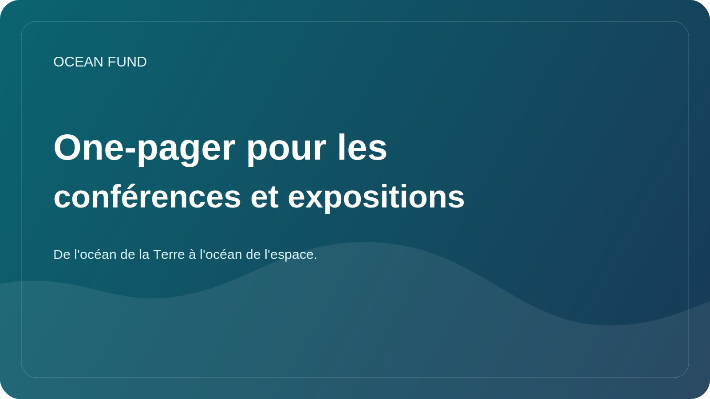

# Conférence/Exposition One-Pager

Cette page est un dossier public compact destiné aux organisateurs de conférences, aux équipes de forum, aux commissaires d'expositions, aux festivals scientifiques, aux musées et aux partenaires d'événements.

## Fonds Océan

Ocean Fund est un pôle de projets ouvert pour l'océan, le climat, la biodiversité, les données marines, l'éducation et les partenariats internationaux.

> De l'océan de la Terre à l'océan de l'espace.

## Pourquoi Ocean Fund s'adapte aux événements

Ocean Fund est conçu pour les formats destinés au public. Le projet traduit les sciences océaniques, les données, l'éducation et l'exploration à long terme en formats pouvant fonctionner sur scène, dans des panels, dans des ateliers, dans des espaces d'exposition et dans des conversations intersectorielles.

## Ce que nous pouvons apporter

- un discours public fort reliant l'océan, le climat, la biodiversité, les données et l'exploration ;
- un cadrage scientifique sans affirmations exagérées ;
- matériel open source et accessible au public ;
- des formats d'événements pouvant aller de courtes conférences à des modules d'exposition ;
- un pont entre les sciences océaniques, l’observation par satellite, l’éducation du public et l’imagination océan-espace.

## Thèmes pertinents

- sciences océaniques et biodiversité;
- la résilience climatique et côtière ;
- données marines et observation de la Terre ;
- science ouverte et connaissances publiques reproductibles ;
- éducation et alphabétisation sur les océans ;
- musées, expositions et communication publique ;
- technologie bleue et innovation ;
- La Terre en tant que monde océanique et récits scientifiques orientés vers l’espace.

## Formats de participation

- discours d'ouverture ou conférence invitée ;
- contribution du panel ;
- atelier ou séance de données ;
- conférence publique;
- concept d'exposition ou de stand;
- format éducatif en musée ou en planétarium ;
- événement parallèle ou conversation entre partenaires.

## Bons concepts de premier événement

- Fonds océanique : infrastructure ouverte pour la recherche océanique, les données, l'éducation et l'engagement du public ;
- De l’océan de la Terre à l’océan de l’espace ;
- Données océaniques ouvertes pour la compréhension et l’éducation du public ;
- La Terre en tant que monde océanique ;
- Océan profond, incertitude profonde et science publique ;
- Connaissance des océans grâce aux données, aux cartes et à la visualisation.

## À quoi peuvent s’attendre les organisateurs

- une description publique concise et réutilisable ;
- copie prête à collaborer pour les sites Web et les programmes ;
- de petits premiers pas concrets au lieu d’un positionnement vague ;
- des itinéraires de coordination sécurisés pour le public via des documents GitHub et des formats de discussion.

## Première étape pour la sécurité publique

Commencez par les informations publiques uniquement :

- nom et format de l'événement ;
- thème et public cible ;
- quel rôle a du sens : conférencier, panéliste, animateur d'atelier, exposant, partenaire ;
- quel résultat public est attendu.

## Itinéraire public recommandé

1. Read [Pour les partenaires](partners.md).
2. Read [Document d'une page pour les partenaires](partner-one-pager.md).
3. Read [Copie de mission publique](mission-copy.md).
4. Review [Modèle de demande de conférence](../../outreach/conference-application-template.md).
5. Passez à une discussion publique ou à une étape suivante suivie.

## Règles de publicité

- pas de partenariats ou de conférenciers non confirmés ;
- pas de contacts privés dans les fils de discussion publics ;
- pas de conditions financières dans les débats publics ;
- aucune affirmation exagérée concernant la portée, le statut ou le travail accompli ;
- pas de négociations d'événements privés sur des questions publiques.

## Réutilisation

Cette page d'une page constitue la pièce jointe ou le lien public recommandé pour :

- candidatures à des conférences ;
- demandes d'exposition;
- sensibilisation aux forums ;
- e-mails de partenariat événementiel ;
- présentations des conférenciers et des panels ;
- matériel de premier contact pour les musées et les festivals.
