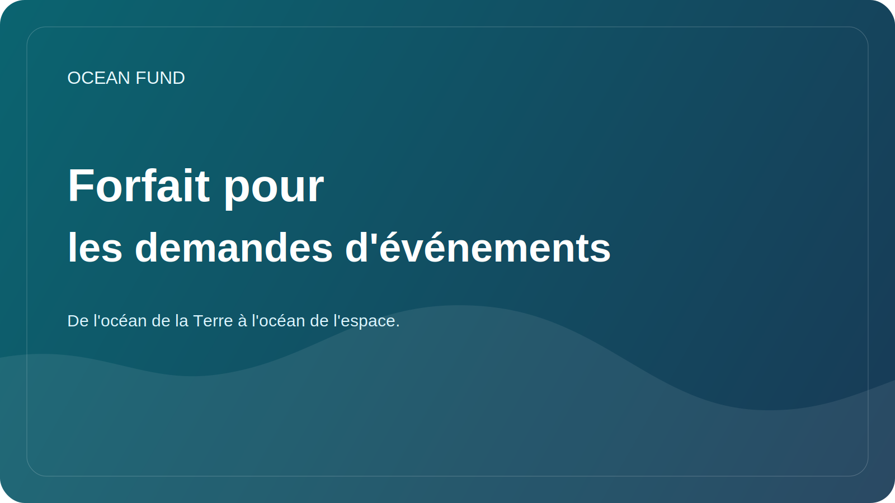

# Pack d'applications pour événements

Cette page est un pack public prêt à l'emploi pour les candidatures à une conférence, les formulaires d'exposition, la sensibilisation aux événements et la communication avec les organisateurs.

Utilisez-le avec :

- [Conférence/Exposition One-Pager](conference-exhibition-one-pager.md)
- [Copie de mission publique](mission-copy.md)

## Courte biographie

Ocean Fund est un pôle de projets ouvert pour l'océan, le climat, la biodiversité, les données marines, l'éducation et les partenariats internationaux. Le projet construit une infrastructure publique de recherche, d’éducation et de technologie qui relie les sciences océaniques, l’observation de la Terre, les connaissances publiques et l’imagination océan-espace.

## Moyenne Bio

Ocean Fund développe une infrastructure ouverte de recherche, d’éducation, de données et de partenariat pour les travaux liés à l’océan. Le projet rassemble les sciences marines, la biodiversité, le climat, l'observation par satellite, la communication publique et les documents publics réutilisables dans un seul environnement prêt à collaborer. Son cadre public relie l'océan de la Terre à l'océan de l'espace, aidant à traduire la science et les données dans des formats compréhensibles pour les institutions, les événements et un public plus large.

## Biographie étendue

Ocean Fund construit une infrastructure accessible au public pour la recherche océanique, les données, l'éducation, l'engagement du public et la collaboration internationale. Le projet est conçu comme une plateforme ouverte où les institutions, les chercheurs, les musées, les développeurs, les organisations à but non lucratif et les partenaires événementiels peuvent se connecter autour de connaissances vérifiées, de matériaux sécurisés pour le public et de formats de collaboration concrets. Son cadre narratif, de l'océan terrestre à l'océan spatial, permet de relier les sciences marines, l'observation de la Terre, la biodiversité, le climat, l'éducation et l'exploration à long terme d'une manière rigoureuse, lisible et utile au public.

## Option abstraite 1 : Introduction générale du projet

Ocean Fund construit une infrastructure publique ouverte pour la recherche océanique, les données marines, l'éducation et la collaboration intersectorielle. Cette session présente le projet comme une plateforme publique structurée plutôt que comme une collection de documents, montrant comment le langage de la mission, les sources de données, les orientations de recherche, les formats de partenariat et les flux de travail basés sur GitHub peuvent soutenir une initiative sérieuse sur l'impact sur les océans. La conférence s'adresse à un public intéressé par les sciences océaniques, la biodiversité, le climat, l'éducation, la connaissance ouverte et les technologies d'intérêt public.

## Option 2 du résumé : Données océaniques et compréhension du public

Les sciences océaniques dépendent de plus en plus de données ouvertes, de l’observation de la Terre et d’une interprétation claire du public. Cette session explore la manière dont Ocean Fund structure les données marines ouvertes, les questions de recherche et les documents destinés au public afin que les scientifiques, les éducateurs, les développeurs et les institutions puissent travailler à partir d'une base commune. Il se concentre sur la traduction pratique : comment passer d'ensembles de données et de sources techniques à des résultats publics compréhensibles, réutilisables et prêts à collaborer sans exagérer les affirmations ni perdre le soin scientifique.

## Option abstraite 3 : Récit de l’océan à l’espace

De l’océan terrestre à l’océan spatial, c’est bien plus qu’un slogan. Il s’agit d’un cadre permettant de relier les sciences marines, l’observation par satellite, la connaissance des océans et l’exploration à long terme dans une seule histoire publique. Cette session présente Ocean Fund comme une plateforme qui relie les écosystèmes océaniques, le climat, la biodiversité, les données et l'imagination de l'espace comme prochain océan d'exploration. Il est conçu pour les événements qui souhaitent un récit scientifique capable de s'adresser aux chercheurs, aux musées, aux programmes éducatifs, au public et aux partenaires interdisciplinaires.

## Cinq titres de discussion

- Fonds Océan : infrastructure ouverte pour la recherche océanique, les données, l'éducation et l'engagement du public
- De l'océan terrestre à l'océan de l'espace
- Données océaniques ouvertes pour la compréhension et la collaboration du public
- La Terre comme monde océanique
- Construire une infrastructure océanique publique sans battage publicitaire

## Modèle d'e-mail de l'organisateur

Objet : Contribution éventuelle du Fonds Océan à [Nom de l'événement]

Bonjour,

Je vous contacte au nom d'Ocean Fund, un pôle de projets ouvert axé sur l'océan, le climat, la biodiversité, les données marines, l'éducation et les partenariats internationaux.

Nous pensons qu'il pourrait y avoir une forte adéquation entre Ocean Fund et [Nom de l'événement], en particulier autour de thèmes tels que les sciences océaniques, l'engagement du public, les données marines, l'éducation, la biodiversité, le climat, les expositions et le dialogue intersectoriel.

Nous pouvons contribuer sous plusieurs formats, en fonction de ce qui est utile à votre programme :

- conférence ou discours d'ouverture ;
- contribution du panel ;
- atelier ou séance de données ;
- concept d'exposition ou d'éducation ;
- événement parallèle ou conversation avec des partenaires.

Matières premières utiles :

- [Conférence/Exposition One-Pager](conference-exhibition-one-pager.md)
- [Copie de mission publique](mission-copy.md)

Le cas échéant, nous serions heureux d’explorer une petite première étape et de voir si elle correspond bien à votre agenda actuel.

Cordialement,
Fonds Océan
`partners@example.org`

Avant l'envoi, remplacez les espaces réservés et utilisez uniquement les coordonnées publiques confirmées.

## Notes d'utilisation

- Utilisez la courte biographie lorsque le formulaire est serré.
- Utilisez la biographie moyenne pour les profils d'orateurs, de partenaires ou d'exposants.
- Utilisez la biographie étendue lorsque l'organisateur demande le contexte complet du projet.
- Choisissez le résumé qui correspond le mieux au thème de l'événement plutôt que de forcer une version universelle.
- Ajustez l'e-mail de l'organisateur uniquement après avoir vérifié l'audience de l'événement, le format et les limites de mots.
