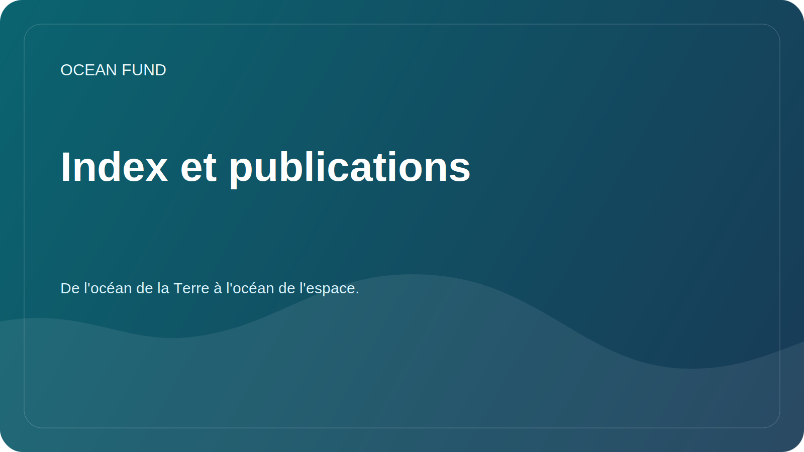

# Index et publications en une seule page

Cette page explique comment Ocean Fund traite les index, les essais, les publications, les atlas et les notes publiques dans le cadre d'un système de connaissances vivant.

## Pourquoi cette couche existe

Le travail océanique est facilement fragmenté. Les notes de recherche se trouvent à un endroit, les essais à un autre, les explications publiques ailleurs et les index de données dans des systèmes distincts. Ocean Fund construit une structure dans laquelle les index, les publications, les cartes de données, le matériel événementiel et les textes de partenariat se renforcent mutuellement au lieu de se séparer.

## Ce que nous entendons par index

Pour Ocean Fund, un indice peut comprendre :

- cartes de sources de données ;
- registres d'ensembles de données ;
- atlas organisationnels ;
- inventaires de sujets ;
- files d'attente pour les publications et les essais ;
- des dossiers d'événements et de sensibilisation ;
- synthèses vérifiées de systèmes de connaissances internes ou externes.

## Ce que nous publions

- résumés sécurisés pour le public ;
- langage de mission et d'événement réutilisable ;
- mémoires axés sur la recherche ;
- registres de données et de sources ;
- des one-pagers pour les partenaires et les événements ;
- matériels pédagogiques et de communication.
- des articles et des essais multilingues dans les six langues officielles de l'ONU.

## Ce que nous ne publions pas

- documents privés;
- contacts personnels;
- réclamations non vérifiées ;
- exportations internes brutes avec identifiants ;
- des détails financiers ou juridiques dont la diffusion publique n’a pas été approuvée.

## Pourquoi c’est important pour Ocean Fund

Cette couche permet au projet de connecter :

- sciences océaniques;
- données marines et satellitaires ;
- l'éducation publique;
- conférences et expositions;
- partenariats et collaboration intersectorielle;
- le pont entre l'océan de la Terre et l'océan de l'espace.

## Réutilisation

Cette page est utile pour expliquer que Ocean Fund ne se contente pas de créer du contenu, mais également de créer la structure d'index qui permet au contenu de circuler à travers la recherche, l'éducation, les événements et la collaboration publique.
