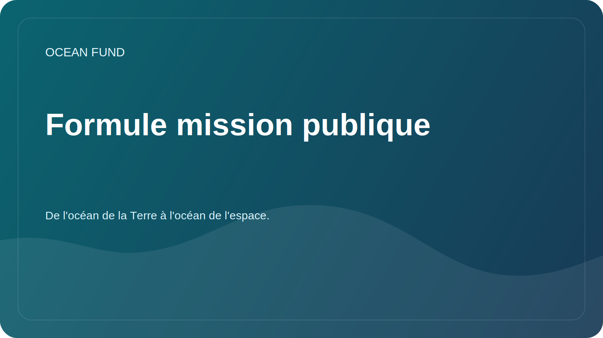

# Copie de mission publique

Cette page est une couche publique obligatoire du Fonds Océan. Il existe pour que les partenaires, médias, contributeurs et institutions puissent réutiliser une description de projet cohérente sans deviner comment le fonds doit être présenté.

## Formule de base

Russe:

> De l'océan de la Terre à l'océan de l'espace.

Anglais:

> De l'océan de la Terre à l'océan de l'espace.

## Copie courte

Russe:

La Fondation Océan construit des infrastructures ouvertes de recherche, d'éducation et de technologie pour l'océan, le climat, la biodiversité, les données marines et les partenariats internationaux.

Anglais:

Ocean Fund construit une infrastructure ouverte de recherche, d'éducation et de technologie pour l'océan, le climat, la biodiversité, les données marines et les partenariats internationaux.

## Copie moyenne

Russe:

La Fondation Océan rassemble la recherche, l'éducation, les données marines, les observations satellitaires et la collaboration internationale autour des objectifs de compréhension et de protection de l'océan. Le projet construit une infrastructure publique à travers laquelle les scientifiques, les musées, les universités, les ONG, les développeurs et les organisations partenaires peuvent se connecter pour collaborer.

Anglais:

Ocean Fund relie la recherche, l'éducation, les données marines, l'observation de la Terre et la collaboration internationale autour du travail de compréhension et de protection de l'océan. Le projet construit une infrastructure publique à travers laquelle les chercheurs, les musées, les universités, les organisations à but non lucratif, les développeurs et les organisations partenaires peuvent rejoindre un travail partagé.

## Copie étendue

Russe:

La Fondation Océan développe une plateforme ouverte pour la recherche, l'éducation, les données, la visualisation et les partenariats internationaux liés à l'océan. Le lien entre les océans de la Terre, les observations par satellite, les connaissances du public et l'image de l'espace comme prochain océan d'exploration est important pour le projet. Cette logique permet de relier les sciences océaniques, l’agenda climatique, la biodiversité, les outils numériques, l’éducation et l’imagination à long terme en un seul système public compréhensible.

Anglais:

Ocean Fund développe une plateforme ouverte pour la recherche, l'éducation, les données, la visualisation et les partenariats internationaux liés à l'océan. Le projet relie délibérément l'océan terrestre à l'observation de la Terre, à la connaissance du public et à l'imagination de l'espace comme prochain océan d'exploration. Ce cadre permet de relier les sciences océaniques, les travaux sur le climat, la biodiversité, les outils numériques, l’éducation et l’imagination publique à long terme au sein d’un système public cohérent.

## Règle d'utilisation

Utilisez cette page comme source principale de descriptions publiques dans :

- Profil GitHub et copie du référentiel ;
- sensibilisation au partenariat;
- discussions et modèles de problèmes ;
- introductions de présentation ;
- applications de conférence, d'exposition et de forum ;
- matériel de premier contact pour les institutions.

En cas de doute, utilisez la version courte ou moyenne plutôt que d’improviser une nouvelle description.
