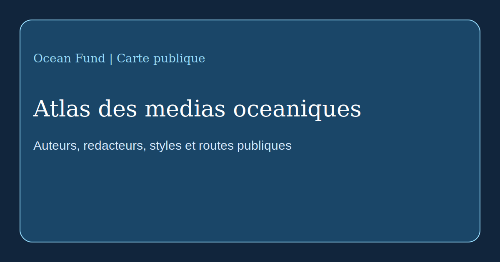

# Atlas des medias oceaniques

Cette page cartographie un premier ensemble de medias, de redacteurs et de modeles de communication publique qui structurent l'ecriture et la circulation des recits sur l'ocean.

Verifie a partir des pages publiques officielles au 13 mai 2026.

## Focus

- Oceanographic Magazine: magazine oceanique tres visuel, porte par des chroniqueurs et l'esprit d'expedition.
- Hakai Magazine: modele archivistique de long-form sur les cotes, la science, la societe et le recit.
- Mongabay Oceans: journalisme environnemental rapide, source et oriente responsabilite.
- Waterfront Alliance / City of Water Day: communication civique sur l'eau et participation publique urbaine.

## Pourquoi c'est important

Ocean Fund doit comprendre non seulement quoi publier, mais comment les architectures editoriales rendent l'ecriture oceanique visible et memorisable.
