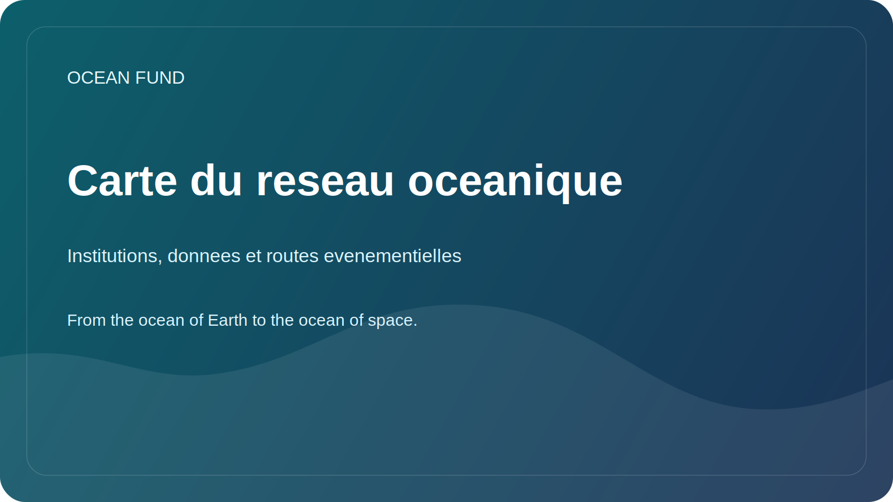

# Carte du reseau oceanique

Cette page est une carte publique compacte des institutions cles, des infrastructures de donnees ouvertes et des grandes routes evenementielles qui structurent l'ecosysteme oceanique mondial autour d'Ocean Fund.

Verifie a partir des sites officiels le 12 mai 2026.

## Pourquoi Cette Page Existe

Le travail sur l'ocean est reparti entre des organes internationaux de coordination, des systemes de donnees ouvertes, des organisations de la societe civile et des conferences recurrentes. Ocean Fund a besoin d'une carte publique pratique de qui fait quoi et de la facon dont le projet peut s'y brancher.

## Science Mondiale et Coordination

- [Ocean Decade](https://oceandecade.org/) coordonne la Decennie des Nations Unies pour les sciences oceaniques au service du developpement durable et fournit un cadre mondial pour les programmes, les actions et l'engagement public.
- [GOOS](https://goosocean.org/what-we-do/) coordonne l'observation oceaniques mondiale soutenue et relie les mesures, la prevision et les services operationnels.
- [OBIS](https://obis.org/about/) est une grande infrastructure ouverte pour les donnees de biodiversite marine et les enregistrements d'occurrence des especes.

## Donnees Ouvertes et Infrastructure Operationnelle

- [Copernicus Marine](https://marine.copernicus.eu/about) fournit des donnees marines ouvertes, des services de prevision et des indicateurs sur l'etat de l'ocean.
- [EMODnet](https://emodnet.ec.europa.eu/en/about-emodnet) rassemble des donnees marines europeennes interoperables dans plusieurs domaines thematiques.

## Action Publique et Engagement Civique

- [Ocean Conservancy](https://oceanconservancy.org/) est une grande organisation d'interet public oeuvrant a l'interface de la science, des politiques et de l'action communautaire.
- [GenOcean](https://oceandecade.org/genocean/) est la campagne de l'Ocean Decade consacree a la mobilisation du public et a la participation citoyenne.

## Grandes Routes Evenementielles

- [UN Ocean Conference](https://sdgs.un.org/conferences/ocean2025/about-unoc-2025) : la derniere conference a eu lieu a Nice du 9 au 13 juin 2025.
- [Our Ocean Conference](https://www.ouroceanconference.org/conferences/mombasa-2026/) : la prochaine edition confirmee est prevue a Mombasa-Kilifi du 16 au 18 juin 2026.
- [Ocean Sciences Meeting](https://www.agu.org/ocean-sciences-meeting/about) : l'edition 2026 a eu lieu a Glasgow du 22 au 27 fevrier 2026.
- [Oceanology International](https://www.oceanologyinternational.com/london/en-gb/about.html) : la prochaine edition londonienne est prevue du 10 au 12 mars 2026.
- [Ocean Business](https://www.oceanbusiness.com/) : la prochaine edition confirmee est prevue a Southampton du 6 au 8 avril 2027.

## Voies d'Entree Pratiques pour Ocean Fund

- publier des briefs publics multilingues et des one-pagers orientes par sujet ;
- suivre les appels a interventions, les evenements paralleles, les opportunites d'exposition et les discussions publiques ;
- transformer chaque organisation ou evenement cible en fiche partenaire, fiche evenement et issue suivante ;
- approcher les infrastructures de donnees et les reseaux de science publique avec des materiaux publics reutilisables plutot qu'avec des messages ad hoc.

## Regle de Travail

Utiliser les sites officiels comme premiere couche de reference. Reverifier les dates, les statuts et les formats de participation avant toute affirmation publique ou tout message sortant.
