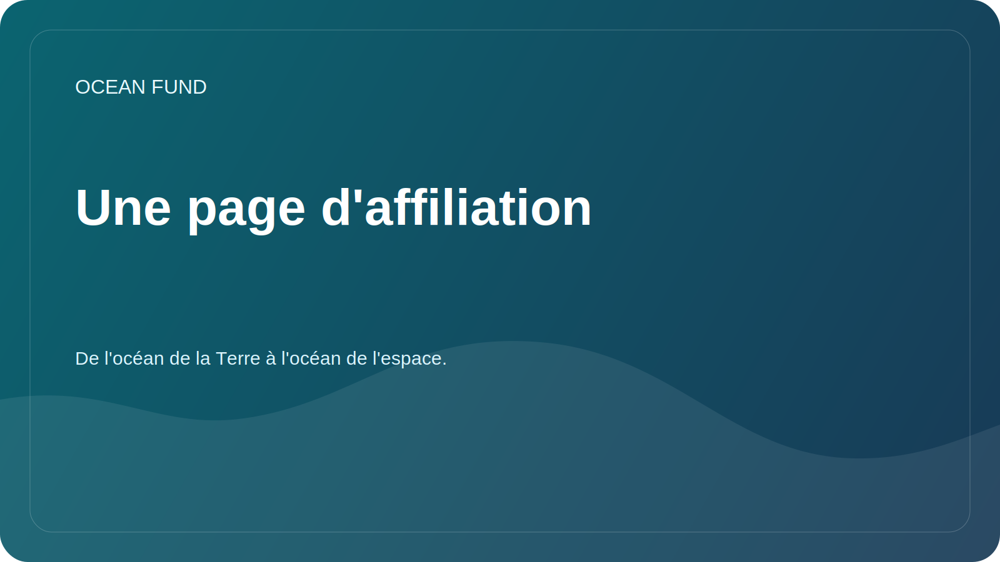

# Document d'une page pour les partenaires

Cette page est un dossier public compact destiné aux institutions, forums, expositions, conférences et sensibilisation de premier contact.

## Fonds Océan

Ocean Fund est un pôle de projets ouvert pour l'océan, le climat, la biodiversité, les données marines, l'éducation et les partenariats internationaux.

> De l'océan de la Terre à l'océan de l'espace.

## Ce que nous construisons

Ocean Fund construit une infrastructure publique de recherche, d’éducation et de technologie autour de la compréhension et de la protection des océans. Le projet relie les sciences marines, l’observation de la Terre, les connaissances publiques et l’exploration à long horizon dans un seul espace de collaboration ouvert.

## Pourquoi c'est important

L’océan est au centre de la régulation climatique, de la biodiversité, des systèmes alimentaires, de la résilience côtière, de la culture, de la science et de l’imagination du public. Pourtant, les opportunités en matière de données, d’éducation, de recherche et de partenariat sont souvent fragmentées. Ocean Fund existe pour faciliter la connexion de ces couches de manière publique, structurée et prête à la collaboration.

## Ce à quoi un partenaire peut s'attendre

- un cadre de collaboration publique clair ;
- un itinéraire de premier contact factuel et peu bruyant ;
- de petits formats de départ concrets au lieu d'un langage de partenariat vague ;
- un environnement de projet ouvert pour les documents, les problèmes, les discussions et les matériaux réutilisables.

## Bons premiers formats de collaboration

- conférence ou séminaire public ;
- dossier de recherche conjoint ;
- examen des ensembles de données ou sprint de cartographie ;
- module d'exposition ou d'éducation;
- atelier, panel ou séance de conférence ;
- format scientifique public océan-espace.

## À qui s'adresse-t-il

- universités et instituts de recherche;
- musées, centres scientifiques et planétariums ;
- les organisations à but non lucratif et les fondations ;
- conférences, forums et expositions;
- communautés open source et de données ;
- les institutions publiques travaillant dans les domaines de l’océan, du climat, de la biodiversité ou de l’éducation.

## Première étape pour la sécurité publique

Commencez par les informations publiques uniquement :

- qui vous êtes ;
- pourquoi la collaboration est pertinente ;
- quel résultat public pourrait exister ;
- quel petit premier pas a du sens.

## Voie d'entrée publique

1. Read [Pour les partenaires](partners.md).
2. Read [Copie de mission publique](mission-copy.md).
3. Consultez les [Partenariats](../../docs/fr/partners.md).
4. Utilisez la catégorie de discussion publique `Partnerships` ou un problème suivi pour l'étape suivante.

## Règles de publicité

- pas de documents privés ;
- aucun contact personnel ;
- pas de conditions financières dans les discussions publiques ;
- aucune réclamation de partenariat non confirmée ;
- pas de déclarations exagérées sur le statut ou la portée.

## Réutilisation

Cette page d'une page constitue la pièce jointe ou le lien public recommandé pour :

- e-mails des premiers partenaires ;
- sensibilisation aux conférences et forums ;
- demandes d'exposition;
- propositions de collaboration;
- brèves introductions institutionnelles.
