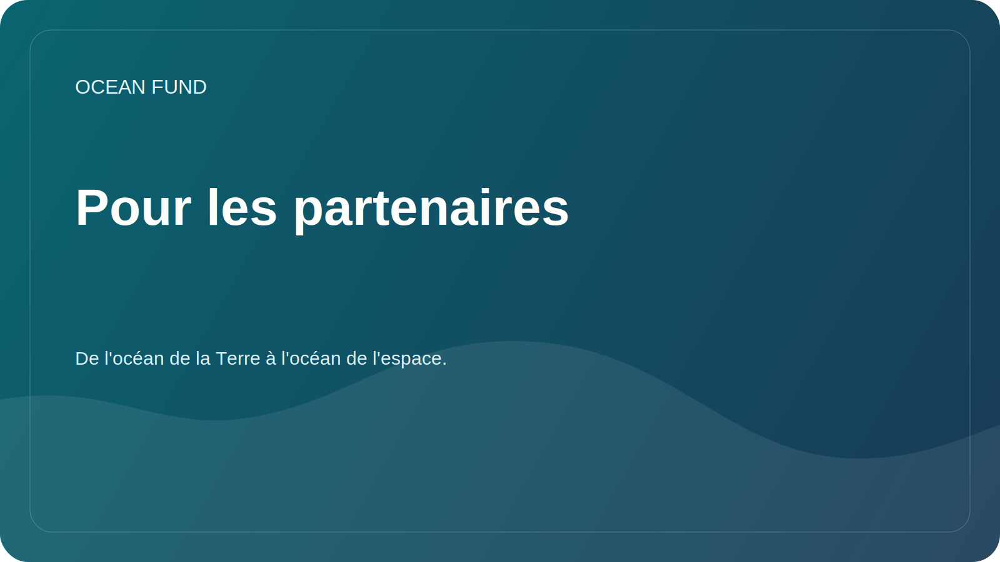

# Pour les partenaires

Ocean Fund est ouvert à la collaboration avec des universités, des musées, des centres de recherche, des organisations à but non lucratif, des conférences, des communautés open source et des institutions publiques travaillant dans les domaines de l'océan, du climat, de la biodiversité, de l'éducation et des données marines.

Cette page est un point d’entrée public obligatoire pour les visiteurs institutionnels. La sensibilisation des partenaires externes devrait commencer ici, avant les documents plus approfondis, les conversations internes ou les étapes de collaboration suivies.

## Commencez ici

Si vous représentez une organisation et souhaitez explorer la collaboration, commencez par des informations publiques uniquement :

- qui est votre organisation ;
- pourquoi la collaboration est pertinente ;
- quel résultat public pourrait exister ;
- quel format convient pour une première étape.

Bons premiers formats :

- conférence ou séminaire ouvert;
- dossier de recherche conjoint ;
- examen des données ou cartographie des ensembles de données ;
- matériel d'exposition ou d'éducation ;
- atelier, panel ou séance de conférence.

## Que utiliser dans ce référentiel

- Utilisez [Document d'une page pour les partenaires](partner-one-pager.md) lorsque vous avez besoin d'un brief externe compact.
- Utilisez [Conférence/Exposition One-Pager](conference-exhibition-one-pager.md) pour une sensibilisation événementielle.
- Lire [Copie de mission publique](mission-copy.md) pour la description du projet approuvé.
- Lisez [Partenariats](../../docs/fr/partners.md) pour le cadre de collaboration.
- Parcourez [Matériel de sensibilisation](../../outreach/README.md) pour les modèles de communication actuels.
- Si les discussions GitHub sont activées, utilisez la catégorie de discussion `Partnerships` pour l'exploration publique.
- Si une action suivie est déjà claire, ouvrez le modèle de problème `Partner lead`.

## Règles de publicité

- Ne publiez pas de numéros de téléphone personnels, d'adresses e-mail personnelles, de documents privés ou de conditions financières.
- Ne décrivez pas les partenariats comme confirmés tant qu’ils ne sont pas formellement approuvés.
- Gardez les premières conversations factuelles, sûres pour le public et spécifiques.

## État actuel du contact public

Ce référentiel contient toujours des espaces réservés dans certains documents destinés au public. Remplacez les coordonnées uniquement après approbation officielle.

## Chemin externe requis

L’itinéraire externe minimum correct pour un nouveau contact institutionnel est :

1. cette page ;
2. [Document d'une page pour les partenaires](partner-one-pager.md);
3. [Copie de mission publique](mission-copy.md);
4. [Partenariats](../../docs/fr/partners.md);
5. débat public ou suivi de la prochaine étape.
