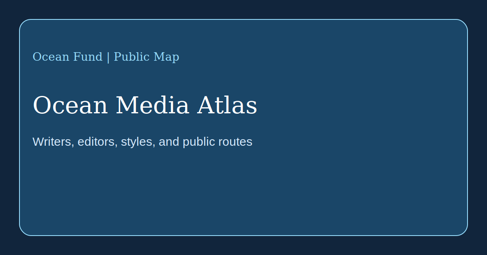

# Ocean Media Atlas

This page maps a first high-signal set of media outlets, editors, and public communication models that shape how ocean stories are written, framed, and circulated.

Verified against official public pages on 13 May 2026.

## Editorial Routes Worth Studying

- [Oceanographic Magazine](https://oceanographicmagazine.com/) works at the intersection of conservation, exploration, and adventure. Its public voice is image-led, magazine-shaped, and personality-driven. Public columnist and contributor names visible on its site include Brianna Fruean, Hannah Rudd, Max Bello, Hugo Tagholm, Cal Major, Gio Reale, and Pen Hadow. Its [work-with-us page](https://oceanographicmagazine.com/work-with-us/) shows an openness to pitches that fit ocean conservation, exploration, or adventure.
- [Hakai Magazine](https://hakaimagazine.com/about-us/) built a long-form coastal science and society publication model. Its official about page says it published features, news, photo essays, short documentaries, and podcasts, and that it ceased publishing in December 2024 while keeping its archive online. Names listed by the magazine include Jude Isabella, Sarah Gilman, Heather Pringle, David Garrison, and Shanna Baker.
- [Mongabay Oceans](https://news.mongabay.com/series/oceans/) represents a faster, accountability-oriented ocean reporting mode. Mongabay's [about page](https://news.mongabay.com/about) frames journalism as a tool for awareness, accountability, and solutions, and its 2025 announcement of a dedicated [Oceans Desk](https://news.mongabay.com/2025/11/mongabay-launches-dedicated-oceans-desk-to-expand-global-reporting-on-marine-ecosystems/amp/) names Rebecca Kessler, Elizabeth Claire Alberts, and Michelle Carrere among the visible team members.
- [Waterfront Alliance / City of Water Day](https://waterfrontalliance.org/city-of-water-day/about/) is not a magazine, but it is a strong civic communication model for water, waterfronts, resilience, and public participation. It is useful when Ocean Fund studies how water stories become festivals, community events, and public urban culture.

## Observed Style Modes

- narrative and place-based: Hakai's coastal long-form model;
- premium visual and expedition-facing: Oceanographic's magazine and columnist model;
- frequent, source-rich, accountability-oriented: Mongabay's ocean desk;
- civic, participatory, and city-facing: Waterfront Alliance's water public sphere.

These style observations are Ocean Fund's own reading of the outlets' public output and positioning.

## What Ocean Fund Should Learn

- how to combine strong imagery with substance rather than decoration;
- how to balance beauty, urgency, and evidence;
- how to publish essays, field stories, interviews, and explainers as one connected ecosystem;
- how to make ocean writing legible for partners, schools, cities, donors, and researchers at the same time.

## Working Rule

Ocean Fund should learn from editorial architectures and public tone, but not mimic another outlet's identity.
