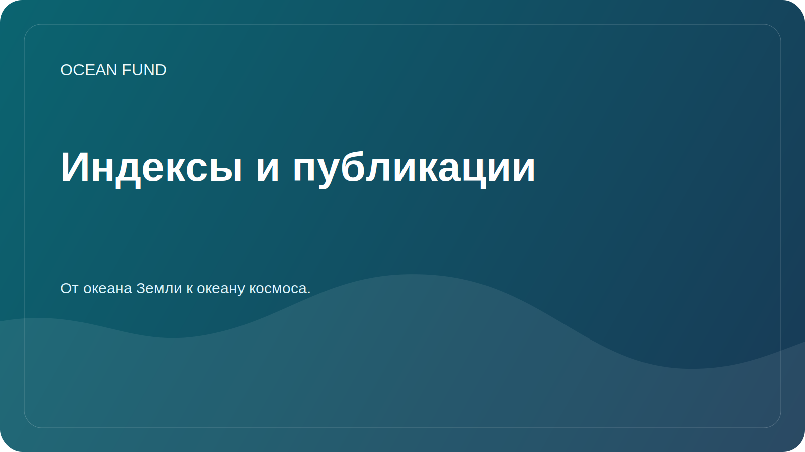

# Indexes and Publications One-Pager

This page explains how Ocean Fund treats indexes, essays, publications, atlases, and public briefs as part of one living knowledge system.

## Why This Layer Exists

Ocean work is easily fragmented. Research notes sit in one place, essays in another, public explanations somewhere else, and data indexes in separate systems. Ocean Fund is building a structure where indexes, publications, data maps, event materials, and partnership texts reinforce one another instead of drifting apart.

## What We Mean by Indexes

For Ocean Fund, an index can include:

- data source maps;
- dataset registers;
- organizational atlases;
- topic inventories;
- publication and essay queues;
- event and outreach packs;
- verified summaries of internal or external knowledge systems.

## What We Publish

- public-safe summaries;
- reusable mission and event language;
- research-facing briefs;
- data and source registers;
- partner and event one-pagers;
- educational and communication materials.
- multilingual article and essay layers in the six official UN languages.

## What We Do Not Publish

- private documents;
- personal contacts;
- unverified claims;
- raw internal exports with identifiers;
- financial or legal details not approved for public release.

## Why This Matters for Ocean Fund

This layer allows the project to connect:

- ocean science;
- marine and satellite data;
- public education;
- conferences and exhibitions;
- partnerships and cross-sector collaboration;
- the bridge from the ocean of Earth to the ocean of space.

## Reuse

This page is useful when explaining that Ocean Fund is not only building content, but also building the index structure that lets content circulate across research, education, events, and public collaboration.
