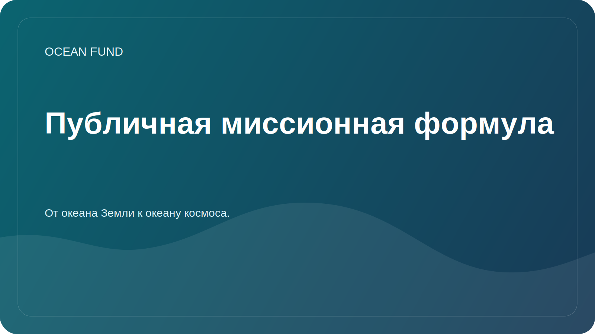

# Public Mission Copy

This page is a required public-facing layer of Ocean Fund. It exists so that partners, media, contributors, and institutions can reuse a consistent project description without guessing how the fund should be presented.

## Core Formula

Russian:

> От океана Земли к океану космоса.

English:

> From the ocean of Earth to the ocean of space.

## Short Copy

Russian:

Фонд «Океан» создает открытую исследовательскую, образовательную и технологическую инфраструктуру для океана, климата, биоразнообразия, морских данных и международных партнерств.

English:

Ocean Fund builds open research, education, and technology infrastructure for ocean, climate, biodiversity, marine data, and international partnerships.

## Medium Copy

Russian:

Фонд «Океан» объединяет исследования, образование, морские данные, спутниковые наблюдения и международное сотрудничество вокруг задач понимания и защиты океана. Проект строит публичную инфраструктуру, через которую ученые, музеи, университеты, НКО, разработчики и партнерские организации могут подключаться к совместной работе.

English:

Ocean Fund connects research, education, marine data, Earth observation, and international collaboration around the work of understanding and protecting the ocean. The project builds a public infrastructure through which researchers, museums, universities, nonprofits, developers, and partner organizations can join shared work.

## Extended Copy

Russian:

Фонд «Океан» развивает открытую платформу для исследований, образования, данных, визуализации и международных партнерств, связанных с океаном. Для проекта важна связка между океаном Земли, спутниковыми наблюдениями, общественным знанием и образом космоса как следующего океана исследования. Эта логика помогает соединять океаническую науку, климатическую повестку, биоразнообразие, цифровые инструменты, просвещение и долгосрочное воображение в одну понятную публичную систему.

English:

Ocean Fund develops an open platform for research, education, data, visualization, and international partnerships related to the ocean. The project deliberately links the ocean of Earth with Earth observation, public knowledge, and the imagination of space as the next ocean of exploration. This framing helps connect ocean science, climate work, biodiversity, digital tools, education, and long-horizon public imagination within one coherent public system.

## Usage Rule

Use this page as the primary source for public descriptions in:

- GitHub profile and repository copy;
- partnership outreach;
- discussions and issue templates;
- presentation intros;
- conference, exhibition, and forum applications;
- first-contact materials for institutions.

When in doubt, use the short or medium version rather than improvising a new description.
