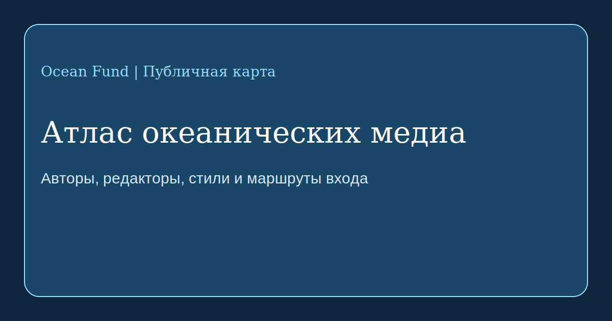

# Атлас океанических медиа

Эта страница собирает первый high-signal набор медиа, редакторов и публичных коммуникационных моделей, которые формируют то, как пишут, собирают и распространяют истории об океане.

Проверено по официальным публичным страницам на 13 мая 2026 года.

## Редакционные маршруты, которые стоит изучать

- [Oceanographic Magazine](https://oceanographicmagazine.com/) работает на стыке conservation, exploration и adventure. Это визуально сильный журнальный формат с заметной ролью колоннистов и лиц проекта. На сайте видны имена Brianna Fruean, Hannah Rudd, Max Bello, Hugo Tagholm, Cal Major, Gio Reale и Pen Hadow. Их [work-with-us page](https://oceanographicmagazine.com/work-with-us/) показывает открытую точку входа для историй про океаническую conservation / exploration / adventure.
- [Hakai Magazine](https://hakaimagazine.com/about-us/) выстроил сильную long-form модель про coastal science и society. Официальная about page пишет, что издание выпускало features, news, photo essays, short documentaries и podcasts, а в декабре 2024 года прекратило новые публикации, сохранив открытый архив. Среди имён, перечисленных самим изданием, есть Jude Isabella, Sarah Gilman, Heather Pringle, David Garrison и Shanna Baker.
- [Mongabay Oceans](https://news.mongabay.com/series/oceans/) представляет более частотную и accountability-oriented модель. [About page](https://news.mongabay.com/about) прямо связывает журналистику с awareness, accountability и solutions, а объявление 2025 года о dedicated [Oceans Desk](https://news.mongabay.com/2025/11/mongabay-launches-dedicated-oceans-desk-to-expand-global-reporting-on-marine-ecosystems/amp/) называет среди заметных участников Rebecca Kessler, Elizabeth Claire Alberts и Michelle Carrere.
- [Waterfront Alliance / City of Water Day](https://waterfrontalliance.org/city-of-water-day/about/) — это не журнал, но очень сильная civic-модель коммуникации про воду, waterfronts, resilience и общественное участие. Для Ocean Fund это важно как пример того, как водная тема превращается в городской фестиваль, публичную повестку и инфраструктуру участия.

## Наблюдаемые стилистические режимы

- narrative и place-based: coastal long-form модель Hakai;
- premium visual и expedition-facing: журнальная модель Oceanographic;
- frequent, source-rich и accountability-oriented: океанический desk Mongabay;
- civic, participatory и city-facing: публичная водная среда Waterfront Alliance.

Эти наблюдения о стиле — это аналитическое чтение Ocean Fund по публичным выходам и позиционированию этих площадок.

## Что должен взять Ocean Fund

- как соединять сильное изображение с содержанием, а не с декоративностью;
- как держать баланс между красотой, тревогой и доказательностью;
- как собрать эссе, полевые истории, интервью и explainers в одну связанную экосистему;
- как сделать океаническое письмо понятным сразу для партнёров, школ, городов, доноров и исследователей.

## Рабочее правило

Ocean Fund должен перенимать редакционные архитектуры и уровень публичного тона, но не копировать чужую идентичность.
