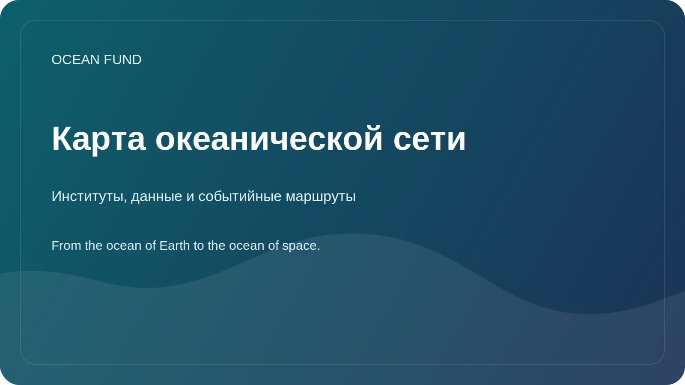

# Карта океанической сети

Эта страница является компактной публичной картой ключевых институтов, открытых инфраструктур данных и основных событийных маршрутов, которые формируют глобальную океаническую экосистему вокруг Ocean Fund.

Страница сверена по официальным сайтам на 12 мая 2026 года.

## Зачем Нужна Эта Страница

Океаническая работа распределена между международными координационными структурами, системами открытых данных, организациями гражданского общества и регулярными конференциями. Ocean Fund нужна практическая публичная карта того, кто что делает и куда проект может встраиваться дальше.

## Глобальная Наука и Координация

- [Ocean Decade](https://oceandecade.org/) координирует Десятилетие наук об океане ООН в интересах устойчивого развития и задает глобальную рамку для программ, действий и общественного участия.
- [GOOS](https://goosocean.org/what-we-do/) координирует устойчивое глобальное наблюдение океана и связывает измерения, прогнозирование и операционные сервисы.
- [OBIS](https://obis.org/about/) является одной из ключевых открытых инфраструктур по данным о морском биоразнообразии и встречаемости видов.

## Открытые Данные и Операционная Инфраструктура

- [Copernicus Marine](https://marine.copernicus.eu/about) предоставляет открытые морские данные, прогнозы и сервисы по состоянию океана.
- [EMODnet](https://emodnet.ec.europa.eu/en/about-emodnet) объединяет интероперабельные европейские морские данные по нескольким тематическим направлениям.

## Публичное Действие и Гражданское Участие

- [Ocean Conservancy](https://oceanconservancy.org/) является крупной общественно значимой океанической организацией на стыке науки, политики и действий сообществ.
- [GenOcean](https://oceandecade.org/genocean/) является кампанией Ocean Decade, ориентированной на широкую общественную мобилизацию и участие граждан.

## Главные Событийные Маршруты

- [UN Ocean Conference](https://sdgs.un.org/conferences/ocean2025/about-unoc-2025): последняя конференция прошла в Ницце 9-13 июня 2025 года.
- [Our Ocean Conference](https://www.ouroceanconference.org/conferences/mombasa-2026/): следующая подтвержденная сессия запланирована в Mombasa-Kilifi на 16-18 июня 2026 года.
- [Ocean Sciences Meeting](https://www.agu.org/ocean-sciences-meeting/about): встреча 2026 года прошла в Глазго 22-27 февраля 2026 года.
- [Oceanology International](https://www.oceanologyinternational.com/london/en-gb/about.html): следующая лондонская сессия запланирована на 10-12 марта 2026 года.
- [Ocean Business](https://www.oceanbusiness.com/): следующая подтвержденная сессия запланирована в Саутгемптоне на 6-8 апреля 2027 года.

## Практические Точки Входа для Ocean Fund

- публиковать многоязычные публичные briefs и предметные one-pagers;
- отслеживать calls for speakers, side events, выставочные возможности и публичные обсуждения;
- превращать каждую целевую организацию или событие в partner card, event card и next-step issue;
- выходить на инфраструктуры данных и сети публичной науки через переиспользуемые материалы, а не через хаотичные сообщения.

## Рабочее Правило

Использовать официальные сайты как первый слой опоры. Перед любым публичным утверждением или внешним письмом перепроверять даты, статусы и форматы участия.
