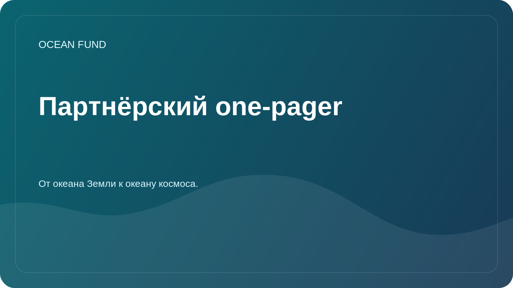

# Partner One-Pager

This page is a compact public brief for institutions, forums, exhibitions, conferences, and first-contact outreach.

## Ocean Fund

Ocean Fund is an open project hub for ocean, climate, biodiversity, marine data, education, and international partnerships.

> From the ocean of Earth to the ocean of space.

## What We Are Building

Ocean Fund is building a public research, education, and technology infrastructure around ocean understanding and protection. The project connects marine science, Earth observation, public knowledge, and long-horizon exploration in one open collaboration space.

## Why This Matters

The ocean sits at the center of climate regulation, biodiversity, food systems, coastal resilience, culture, science, and public imagination. Yet data, education, research, and partnership opportunities are often fragmented. Ocean Fund exists to make these layers easier to connect in a public, structured, and collaboration-ready way.

## What A Partner Can Expect

- a clear public collaboration frame;
- a factual and low-noise first-contact route;
- small, concrete starting formats instead of vague partnership language;
- an open project environment for documents, issues, discussions, and reusable materials.

## Good First Collaboration Formats

- public lecture or seminar;
- joint research brief;
- dataset review or mapping sprint;
- exhibition or education module;
- workshop, panel, or conference session;
- ocean-to-space public science format.

## Who This Is For

- universities and research institutes;
- museums, science centers, and planetariums;
- nonprofits and foundations;
- conferences, forums, and exhibitions;
- open-source and data communities;
- public institutions working across ocean, climate, biodiversity, or education.

## Public-Safe First Step

Start with public information only:

- who you are;
- why the collaboration is relevant;
- what public-facing result could exist;
- what small first step makes sense.

## Public Entry Route

1. Read [For Partners](partners.md).
2. Read [Public Mission Copy](mission-copy.md).
3. Review [Partnerships](../docs/partners.md).
4. Use the public `Partnerships` discussion category or a tracked issue for the next step.

## Publicity Rules

- no private documents;
- no personal contacts;
- no financial terms in public threads;
- no unconfirmed partnership claims;
- no exaggerated statements about status or scope.

## Reuse

This one-pager is the recommended public attachment or link for:

- first partner emails;
- conference and forum outreach;
- exhibition applications;
- collaboration proposals;
- short institutional introductions.
