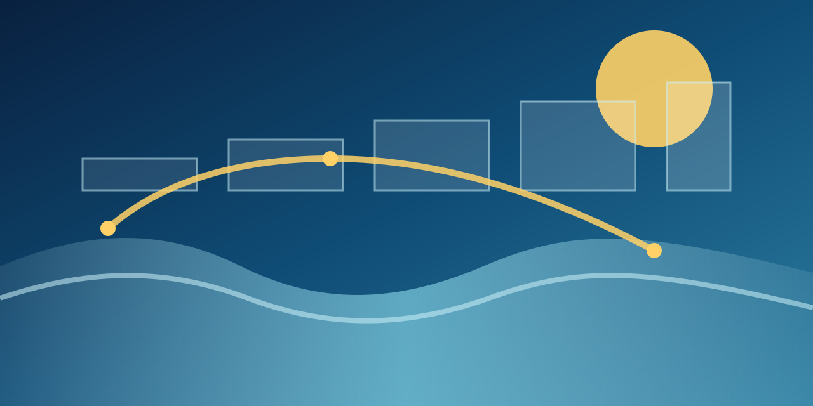

# Weekly Ocean Ratings

Ocean Fund will publish weekly ratings from its confirmed index layer so the ocean, climate, floating-city, and public-intelligence field becomes readable to the world.

## Weekly Tracks

- Water and Monitoring Rating
- Coastal Climate and Resilience Rating
- Floating Ocean Urbanism Rating
- Public Ocean Intelligence Rating
- Ocean Worlds and Space Watch

## Index Basis

The confirmed index portfolio currently tracked in the public-safe layer includes:

- `SDI`
- `RTOHI`
- `WEMI`
- `CCHPI`
- `3DPESI`
- `SWQI`
- `NLWI`
- `UCPWRI`

## Publication Rule

Every weekly release should state:

- which index line or lines it uses;
- what entities, places, systems, or projects are being compared;
- what is measured directly and what remains interpretive;
- what changed since the previous week;
- what remains outside the current scoring basis.

## Current Status

The weekly publication line is now active. The first comparative weekly editions will grow from the existing index portfolio and its public methodology notes as they are expanded in the repository.
