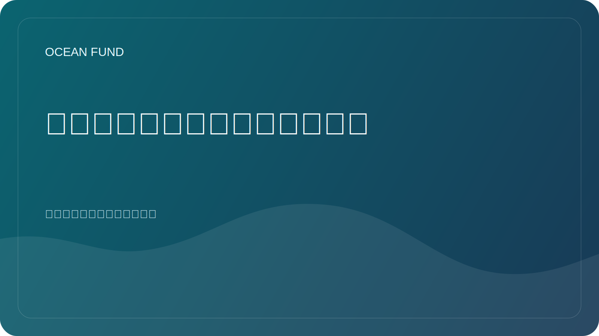

# 会议/展览单页机

本页面是为会议组织者、论坛团队、展览策展人、科学节、博物馆和活动合作伙伴提供的简短公开简报。

## 海洋基金

海洋基金是一个针对海洋、气候、生物多样性、海洋数据、教育和国际合作伙伴关系的开放项目中心。

> 从地球的海洋到太空的海洋。

## 为什么海洋基金适合活动

海洋基金是为面向公众的形式而设计的。该项目将海洋科学、数据、教育和长期探索转化为可以在舞台、小组、研讨会、展览空间和跨部门对话中发挥作用的形式。

## 我们能带来什么

- 连接海洋、气候、生物多样性、数据和探索的强有力的公共叙事；
- 基于科学的框架，没有夸大的主张；
- 开源和可供公众使用的材料；
- 活动形式可以从简短的演讲扩展到展览模块；
- 海洋科学、卫星观测、公共教育和海洋到太空想象力之间的桥梁。

## 相关主题

- 海洋科学和生物多样性；
- 气候和沿海复原力；
- 海洋数据和地球观测；
- 开放科学和可复制的公共知识；
- 海洋教育和扫盲；
- 博物馆、展览和公共传播；
- 蓝色科技与创新；
- 地球作为一个海洋世界和面向太空的科学叙述。

## 参与形式

- 主题演讲或受邀演讲；
- 小组贡献；
- 研讨会或数据会议；
- 公开讲座；
- 展览或展位概念；
- 博物馆或天文馆教育形式；
- 会外活动或合作伙伴对话。

## 良好的第一个活动概念

- 海洋基金：海洋研究、数据、教育和公众参与的开放基础设施；
- 从地球的海洋到太空的海洋；
- 开放海洋数据以供公众理解和教育；
- 地球是一个海洋世界；
- 深海、深度不确定性和公共科学；
- 通过数据、地图和可视化提高海洋素养。

## 组织者可以期待什么

- 简洁且可重复使用的公开描述；
- 网站和程序的协作就绪副本；
- 小而具体的第一步，而不是模糊的定位；
- 通过 GitHub 文档和讨论格式进行公共安全协调。

## 公共安全的第一步

仅从公开信息开始：

- 活动名称和形式；
- 主题和目标受众；
- 什么角色有意义：演讲者、小组成员、研讨会主持人、参展商、合作伙伴；
- 预期的公众结果是什么。

## 推荐公共路线

1. Read [对于合作伙伴](partners.md).
2. Read [合作伙伴单页机](partner-one-pager.md).
3. Read [公共任务副本](mission-copy.md).
4. Review [会议申请模板](../outreach/conference-application-template.md).
5. 转向公开讨论或跟踪的下一步。

## 公示规则

- 没有未经确认的合作伙伴或发言人；
- 公共线程中没有私人联系人；
- 公开讨论中没有财务条款；
- 没有夸大其范围、状态或已完成工作的声明；
- 私人活动中不得就公共问题进行谈判。

## 重复利用

此单页程序是推荐的公共附件或链接：

- 会议申请；
- 展览申请；
- 论坛外展；
- 活动合作伙伴电子邮件；
- 演讲者和小组介绍；
- 博物馆和节日的第一接触材料。
