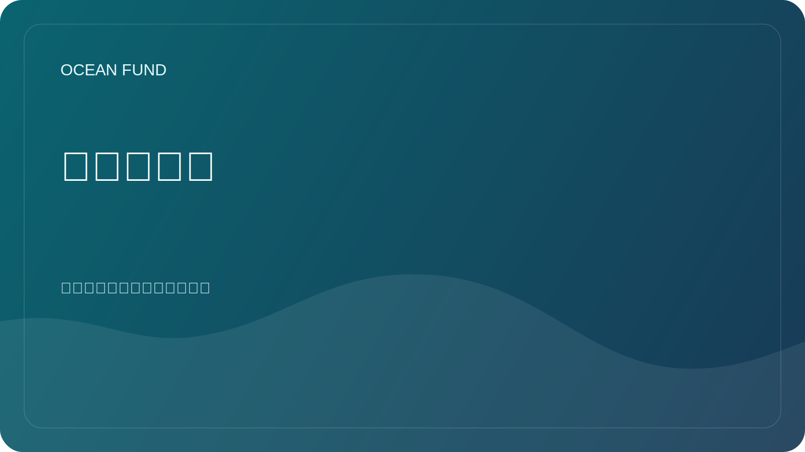

# 活动应用包

此页面是一个即用型公共包，用于会议申请、展览表格、活动推广和组织者沟通。

与以下产品一起使用：

- [会议/展览单页机](conference-exhibition-one-pager.md)
- [公共任务副本](mission-copy.md)

## 简短的简历

海洋基金是一个针对海洋、气候、生物多样性、海洋数据、教育和国际合作伙伴关系的开放项目中心。该项目建立了一个连接海洋科学、地球观测、公共知识和海洋到太空想象力的公共研究、教育和技术基础设施。

## 中等生物

海洋基金为海洋相关工作开发开放研究、教育、数据和合作基础设施。该项目将海洋科学、生物多样性、气候、卫星观测、公共传播和可重复使用的公共材料汇集在一个协作就绪的环境中。其公共框架将地球的海洋与太空的海洋连接起来，帮助将科学和数据转化为机构、活动和更广泛的受众可以理解的格式。

## 扩展生物

海洋基金正在为海洋研究、数据、教育、公众参与和国际合作建设面向公众的基础设施。该项目被设计为一个开放的中心，机构、研究人员、博物馆、开发商、非营利组织和活动合作伙伴可以围绕经过验证的知识、公共安全材料和具体的协作格式进行联系。它的叙事框架从地球的海洋到太空的海洋，有助于以一种严谨、易读且对公众有用的方式将海洋科学、地球观测、生物多样性、气候、教育和长期探索联系起来。

## 摘要选项1：一般项目介绍

海洋基金正在为海洋研究、海洋数据、教育和跨部门合作建设开放的公共基础设施。本次会议将该项目介绍为一个结构化的公共中心，而不是松散的材料集合，展示了任务语言、数据源、研究方向、合作伙伴格式和基于 GitHub 的工作流程如何支持一项严肃的海洋影响倡议。该演讲与对海洋科学、生物多样性、气候、教育、开放知识和公共利益技术感兴趣的听众相关。

## 摘要选项 2：海洋数据和公众理解

海洋科学越来越依赖于开放数据、地球观测和清晰的公众解释。本次会议探讨海洋基金如何构建开放的海洋数据、研究问题和面向公众的材料，以便科学家、教育工作者、开发人员和机构能够在共享基础上开展工作。它侧重于实用翻译：如何从数据集和技术来源转向可理解、可重用和可协作的公共输出，而不夸大主张或失去科学关怀。

## 摘要选项 3：从海洋到太空的叙事

从地球的海洋到太空的海洋不仅仅是一句口号。它是一个在一个公共故事中将海洋科学、卫星观测、海洋知识和长期探索联系起来的框架。本次会议将海洋基金作为一个平台，将海洋生态系统、气候、生物多样性、数据和太空想象作为下一个海洋探索联系起来。它专为需要能够与研究人员、博物馆、教育项目、公众观众和跨学科合作伙伴对话的基于科学的叙述的活动而设计。

## 五个演讲标题

- 海洋基金：海洋研究、数据、教育和公众参与的开放基础设施
- 从地球的海洋到太空的海洋
- 开放海洋数据以供公众理解和协作
- 地球是一个海洋世界
- 不炒作地建设公共海洋基础设施

## 组织者电子邮件模板

主题：海洋基金可能对[活动名称]做出贡献

你好，

我代表海洋基金伸出援手，该基金是一个专注于海洋、气候、生物多样性、海洋数据、教育和国际伙伴关系的开放项目中心。

我们相信海洋基金和[活动名称]之间可能存在很强的契合度，尤其是在海洋科学、公众参与、海洋数据、教育、生物多样性、气候、展览和跨部门对话等主题方面。

我们可以以多种形式做出贡献，具体取决于什么对您的计划有用：

- 演讲或主题演讲；
- 小组贡献；
- 研讨会或数据会议；
- 展览或教育理念；
- 会外活动或面向合作伙伴的对话。

有用的起始材料：

- [会议/展览单页机](conference-exhibition-one-pager.md)
- [公共任务副本](mission-copy.md)

如果相关，我们很乐意探索第一步，看看是否与您当前的议程相匹配。

此致，
海洋基金
__代码0__

发送之前，请替换占位符并仅使用经过确认的公开联系信息。

## 使用说明

- 当表格很紧时，使用简短的简介。
- 使用媒体简介来介绍演讲者、合作伙伴或参展商的简介。
- 当组织者要求完整的项目背景时，请使用扩展简介。
- 选择最符合活动主题的摘要，而不是强制使用一个通用版本。
- 仅在检查活动受众、格式和字数限制后调整组织者电子邮件。
