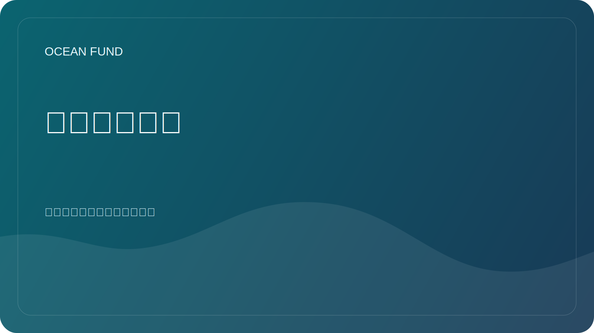

# 索引和出版物单页

本页介绍了海洋基金如何将索引、论文、出版物、地图集和公共简报视为一个活知识系统的一部分。

## 为什么存在这一层

海洋工作很容易分散。研究笔记放在一个地方，论文放在另一个地方，公共解释放在其他地方，数据索引放在不同的系统中。海洋基金正在构建一种结构，其中索引、出版物、数据地图、活动材料和合作文本相互加强而不是渐行渐远。

## 索引是什么意思

对于海洋基金来说，指数可以包括：

- 数据源地图；
- 数据集寄存器；
- 组织图册；
- 主题清单；
- 出版物和论文队列；
- 活动和外展包；
- 内部或外部知识系统的经过验证的摘要。

## 我们发布什么

- 公共安全摘要；
- 可重复使用的任务和活动语言；
- 面向研究的简报；
- 数据和源寄存器；
- 合作伙伴和活动单页机；
- 教育和交流材料。
- 联合国六种官方语言的多语言文章和论文层。

## 我们不发布的内容

- 私人文件；
- 个人联系方式；
- 未经证实的说法；
- 带有标识符的原始内部导出；
- 未批准公开发布的财务或法律细节。

## 为什么这对海洋基金很重要

该层允许项目连接：

- 海洋科学；
- 海洋和卫星数据；
- 公共教育；
- 会议和展览；
- 伙伴关系和跨部门合作；
- 从地球海洋到太空海洋的桥梁。

## 重复利用

此页面有助于解释海洋基金不仅在构建内容，而且还在构建索引结构，让内容在研究、教育、活动和公共合作中流通。
