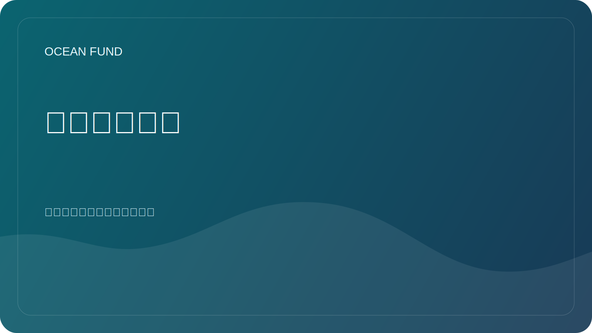

# 公共任务副本

该页面是海洋基金必需的面向公众的页面。它的存在是为了让合作伙伴、媒体、贡献者和机构可以重复使用一致的项目描述，而无需猜测基金应该如何呈现。

## 核心公式

俄语：

> 从地球的海洋到太空的海洋。

英语：

> 从地球的海洋到太空的海洋。

## 短文案

俄语：

海洋基金会为海洋、气候、生物多样性、海洋数据和国际伙伴关系建立开放的研究、教育和技术基础设施。

英语：

海洋基金为海洋、气候、生物多样性、海洋数据和国际伙伴关系建立开放的研究、教育和技术基础设施。

## 中型副本

俄语：

海洋基金会围绕了解和保护海洋的目标，汇集了研究、教育、海洋数据、卫星观测和国际合作。该项目正在建设一个公共基础设施，科学家、博物馆、大学、非政府组织、开发商和合作伙伴组织可以通过该基础设施进行联系和协作。

英语：

海洋基金将研究、教育、海洋数据、地球观测和围绕了解和保护海洋的国际合作联系起来。该项目建立了一个公共基础设施，研究人员、博物馆、大学、非营利组织、开发商和合作组织可以通过该基础设施参与共享工作。

## 扩展副本

俄语：

海洋基金会为海洋相关研究、教育、数据、可视化和国际合作伙伴关系开发了一个开放平台。该项目的重要内容是地球海洋、卫星观测、公共知识和作为下一个探索海洋的太空形象之间的联系。这一逻辑有助于将海洋科学、气候议程、生物多样性、数字工具、教育和长期想象力连接成一个易于理解的公共系统。

英语：

海洋基金为与海洋相关的研究、教育、数据、可视化和国际合作伙伴关系开发了一个开放平台。该项目有意将地球海洋与地球观测、公共知识和太空想象联系起来，作为下一个探索海洋。这一框架有助于将海洋科学、气候工作、生物多样性、数字工具、教育和长远的公众想象力连接到一个连贯的公共系统中。

## 使用规则

使用此页面作为公共描述的主要来源：

- GitHub 配置文件和存储库副本；
- 伙伴关系外展；
- 讨论和问题模板；
- 演示介绍；
- 会议、展览、论坛应用；
- 机构的首次接触材料。

如有疑问，请使用简短或中等版本，而不是即兴创作新的描述。
