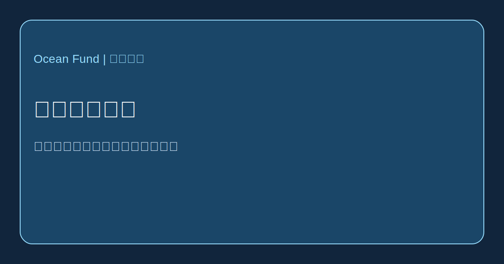

# 海洋媒体图谱

本页梳理第一批高信号海洋媒体、编辑与公共传播模型，用来理解海洋故事如何被书写、塑造和传播。

依据官方公开页面核对，截至 2026 年 5 月 13 日。

## Focus

- Oceanographic Magazine：高度视觉化、带有专栏和远征气质的海洋杂志。
- Hakai Magazine：围绕海岸、科学、社会与叙事新闻的长篇档案型模式。
- Mongabay Oceans：高频、重来源、强调问责的环境报道。
- Waterfront Alliance / City of Water Day：围绕水与城市参与的公共传播模式。

## 为什么重要

Ocean Fund 需要理解的不只是“发布什么”，还包括什么样的编辑结构能让海洋写作变得清晰并留下记忆。
