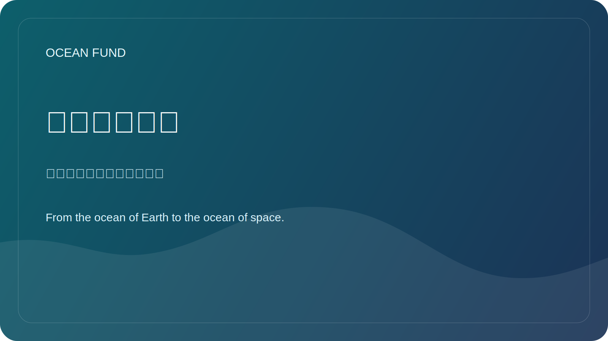

# 海洋网络地图

本页是一张紧凑的公共地图，概述围绕 Ocean Fund 的全球海洋生态系统中的关键机构、开放数据基础设施和主要活动路径。

本页已根据官方网站于2026年5月12日核对。

## 为什么需要这一页

海洋工作分散在国际协调机构、开放数据系统、公民社会组织和持续性的会议之间。Ocean Fund 需要一张实用的公共地图，说明谁在做什么，以及项目下一步可以接入哪里。

## 全球科学与协调

- [Ocean Decade](https://oceandecade.org/) 负责协调联合国海洋科学促进可持续发展十年，并为项目、行动和公众参与提供全球框架。
- [GOOS](https://goosocean.org/what-we-do/) 协调持续性的全球海洋观测，并把测量、预报和业务服务连接起来。
- [OBIS](https://obis.org/about/) 是海洋生物多样性数据和物种出现记录的重要开放基础设施。

## 开放数据与业务基础设施

- [Copernicus Marine](https://marine.copernicus.eu/about) 提供开放海洋数据、预报和海洋状态服务。
- [EMODnet](https://emodnet.ec.europa.eu/en/about-emodnet) 汇集多个主题领域中可互操作的欧洲海洋数据。

## 公共行动与公民参与

- [Ocean Conservancy](https://oceanconservancy.org/) 是一个重要的公共利益海洋组织，工作横跨科学、政策和社区行动。
- [GenOcean](https://oceandecade.org/genocean/) 是 Ocean Decade 面向公众动员和公民参与的行动计划。

## 主要活动路径

- [UN Ocean Conference](https://sdgs.un.org/conferences/ocean2025/about-unoc-2025)：最近一届大会于2025年6月9日至13日在尼斯举行。
- [Our Ocean Conference](https://www.ouroceanconference.org/conferences/mombasa-2026/)：下一届已确认于2026年6月16日至18日在蒙巴萨 - 基利菲举行。
- [Ocean Sciences Meeting](https://www.agu.org/ocean-sciences-meeting/about)：2026年会议已于2026年2月22日至27日在格拉斯哥举行。
- [Oceanology International](https://www.oceanologyinternational.com/london/en-gb/about.html)：下一届伦敦展会定于2026年3月10日至12日举行。
- [Ocean Business](https://www.oceanbusiness.com/)：下一届已确认于2027年4月6日至8日在南安普敦举行。

## Ocean Fund 的实际接入路径

- 发布多语种公共简报和议题导向的 one-pager；
- 跟踪演讲征集、边会、展览机会和公共讨论；
- 将每个目标组织或活动转化为合作伙伴卡、活动卡和下一步 issue；
- 用可复用的公共材料接触数据基础设施和公共科学网络，而不是临时式沟通。

## 工作规则

将官方网站作为第一层参考。任何公开表述或外部联系前，都要重新核对日期、状态和参与形式。
