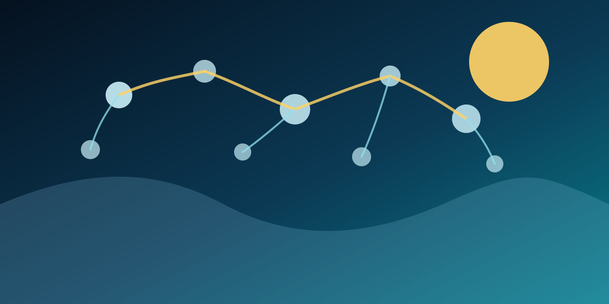

# 海洋观测基础设施地图

这张地图突出展示了使海洋在行星尺度上变得可测量、可共享、并日益可理解的核心公共基础设施。

## 为什么这一层重要

Ocean Fund 需要理解的不只是故事和组织，还包括观测骨架：那些生产数据、协调平台、绘制海底、组织生物多样性记录，并把分散测量转化为公共智能的系统。

## 核心基础设施

- [GOOS](https://goosocean.org/what-we-do/) — 由 UNESCO 政府间海洋学委员会领导的全球海洋观测系统，承担持续且协调的观测使命。
- [Argo](https://www.aoml.noaa.gov/proj/argo/) — 测量温度、盐度以及越来越多海洋属性的全球浮标网络。
- [OceanOPS](https://goosocean.org/who-we-are/observations-coordination-group/oceanops/) — 监测并协调观测网络和元数据流的运行枢纽。
- [Copernicus Marine](https://marine.copernicus.eu/about) — 重要的公共海洋状态信息、预报和海洋气候智能服务。
- [EMODnet](https://emodnet.ec.europa.eu/en/about_emodnet) — 汇集测深、地质、物理、化学、生物、栖息地和人类活动数据的欧洲海洋数据服务。
- [OBIS](https://obis.org/about/) — 海洋生物多样性信息系统，是海洋生命出现数据的全球知识基础设施。
- [Seabed 2030](https://seabed2030.org/our-mission/) — 到 2030 年绘制完整海底地图的全球使命。

## Ocean Fund 应从中学习什么

- 观测系统如何成为值得信赖的长期基础设施；
- 物理、化学、生物和测绘数据如何被协调；
- 公共数据系统如何支持气候、预警、生物多样性和海洋健康；
- 海洋智能如何同时依赖船舶和卫星、传感器和标准、元数据和治理；
- 这套地球海洋基础设施如何启发对海洋世界和行星尺度观测的思考。

## Ocean Fund 的方向

Ocean Fund 应把观测基础设施视为其核心公共知识层之一。没有这一层，指数、评级、文章和公共解释都会显得浅薄。有了这一层，基金就能建立更强的排名、图谱、论文和教育路径，并建立在真实的观测架构之上。
