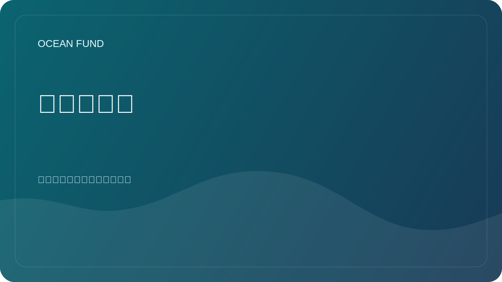

# 合作伙伴单页机

本页面是针对机构、论坛、展览、会议和首次接触外展的紧凑公共简报。

## 海洋基金

海洋基金是一个针对海洋、气候、生物多样性、海洋数据、教育和国际合作伙伴关系的开放项目中心。

> 从地球的海洋到太空的海洋。

## 我们正在建设什么

海洋基金正在围绕海洋了解和保护建立公共研究、教育和技术基础设施。该项目将海洋科学、地球观测、公共知识和长期探索连接在一个开放的协作空间中。

## 为什么这很重要

海洋处于气候调节、生物多样性、粮食系统、沿海恢复力、文化、科学和公众想象力的中心。然而，数据、教育、研究和合作机会往往是分散的。海洋基金的存在是为了使这些层更容易以公共、结构化和协作就绪的方式连接。

## 合作伙伴可以期待什么

- 明确的公共合作框架；
- 真实且低噪音的首次接触路线；
- 小而具体的起始格式，而不是模糊的合作语言；
- 用于文档、问题、讨论和可重用材料的开放项目环境。

## 良好的第一个协作格式

- 公开讲座或研讨会；
- 联合研究简介；
- 数据集审查或绘图冲刺；
- 展览或教育模块；
- 研讨会、小组会议或会议；
- 海洋到太空的公共科学格式。

## 这是给谁的

- 大学和研究机构；
- 博物馆、科学中心和天文馆；
- 非营利组织和基金会；
- 会议、论坛、展览；
- 开源和数据社区；
- 跨海洋、气候、生物多样性或教育开展工作的公共机构。

## 公共安全的第一步

仅从公开信息开始：

- 你是谁；
- 为什么合作具有相关性；
- 可能存在哪些面向公众的结果；
- 小小的第一步是有意义的。

## 公众进入路线

1. Read [对于合作伙伴](partners.md).
2. Read [公共任务副本](mission-copy.md).
3. Review [合作伙伴](../../docs/zh/partners.md).
4. 使用公共 `Partnerships` 讨论类别或跟踪问题进行下一步。

## 公示规则

- 没有私人文件；
- 没有私人联系；
- 公共线程中没有财务术语；
- 没有未经证实的合伙关系主张；
- 没有关于地位或范围的夸大陈述。

## 重复利用

此单页程序是推荐的公共附件或链接：

- 第一个合作伙伴电子邮件；
- 会议和论坛外展；
- 展览申请；
- 合作建议；
- 简短的机构介绍。
