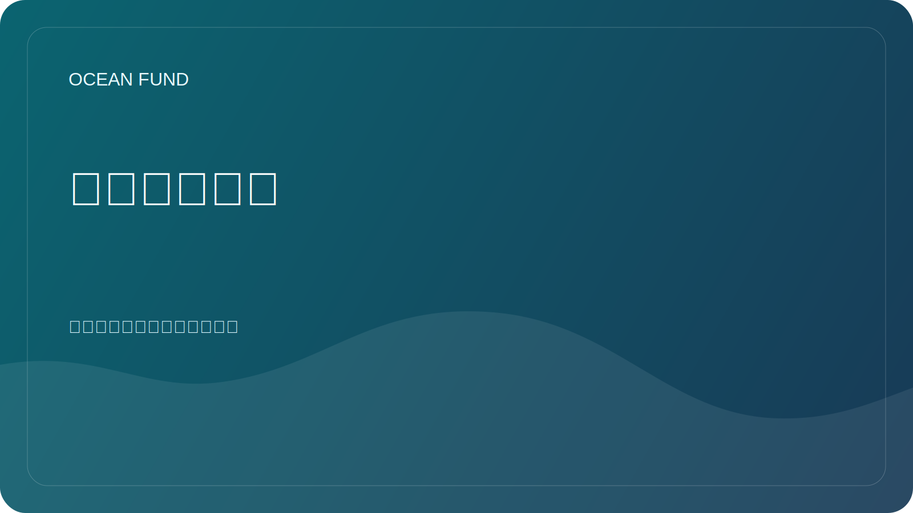

# 对于合作伙伴

海洋基金愿意与大学、博物馆、研究中心、非营利组织、会议、开源社区以及在海洋、气候、生物多样性、教育和海洋数据领域开展工作的公共机构合作。

此页面是机构访客的强制性公共入口点。外部合作伙伴外展应首先引导至此，然后再进行更深入的文档、内部对话或跟踪的协作步骤。

## 从这里开始

如果您代表一个组织并希望探索协作，请仅从公共信息开始：

- 您的组织是谁；
- 为什么合作具有相关性；
- 可能存在哪些面向公众的结果；
- 什么格式对第一步有意义。

良好的第一个格式：

- 公开讲座或研讨会；
- 联合研究简介；
- 数据审查或数据集映射；
- 展览或教育材料；
- 研讨会、小组或会议。

## 在此存储库中使用什么

- Use [合作伙伴单页机](partner-one-pager.md) when you need a compact external brief.
- Use [会议/展览单页机](conference-exhibition-one-pager.md) for event-facing outreach.
- Read [公共任务副本](mission-copy.md) for the approved project description.
- Read [合作伙伴](../docs/partners.md) for the collaboration frame.
- Browse [外展材料](../outreach/README.md) for current communication templates.
- 如果启用了 GitHub 讨论，请使用 `Partnerships` 讨论类别进行公共探索。
- 如果跟踪的操作已经明确，请打开 `Partner lead` 问题模板。

## 公示规则

- 请勿发布个人电话号码、个人电子邮件地址、私人文件或财务条款。
- 在正式批准之前，请勿将合作伙伴关系描述为已确认。
- 保持早期对话真实、公共安全且具体。

## 当前公众联系状态

该存储库仍然包含一些面向公众的材料中的占位符。仅在官方批准后更换联系方式。

## 所需的外部路径

新机构联系人的最低正确外部路线是：

1. 本页；
2. [合作伙伴单页机](partner-one-pager.md);
3. [公共任务副本](mission-copy.md);
4. [合作伙伴](../docs/partners.md);
5. 公开讨论或跟踪下一步。
