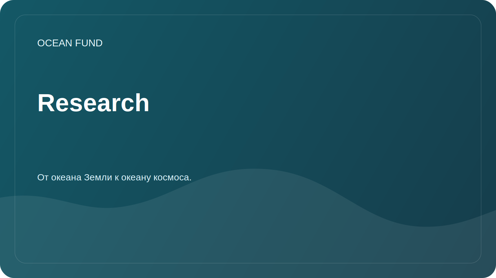

# Research

Раздел собирает исследовательские направления фонда «Океан». Это не архив готовых научных результатов, а открытая рабочая карта вопросов, источников данных и возможных вкладов.

## Направления

| Файл | Тема |
| --- | --- |
| [`ocean-biodiversity.md`](ocean-biodiversity.md) | Морское биоразнообразие и экосистемы |
| [`ocean-climate.md`](ocean-climate.md) | Океан и климат |
| [`marine-pollution.md`](marine-pollution.md) | Морское загрязнение |
| [`ocean-data-infrastructure.md`](ocean-data-infrastructure.md) | Инфраструктура океанических данных |
| [`blue-economy.md`](blue-economy.md) | Устойчивая морская экономика |
| [`ocean-worlds-space.md`](ocean-worlds-space.md) | Океаны, космос, ocean worlds и астробиология |

## Как добавлять исследование

- сформулировать вопрос;
- указать источники и дату доступа;
- отделить проверенные факты от гипотез;
- добавить возможный формат результата: обзор, dataset card, notebook, visualization, partner brief;
- создать issue по шаблону research task.

## Статусы материалов

| Статус | Значение |
| --- | --- |
| `draft` | Черновик для обсуждения |
| `needs verification` | Требуется проверка источников или формулировок |
| `public ready` | Материал можно показывать внешним участникам |
