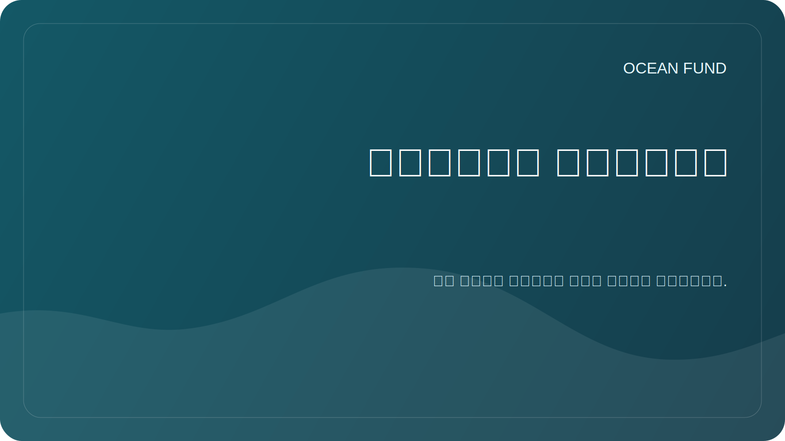

# التلوث البحري

## ركز

يشمل التلوث البحري البلاستيك، والجسيمات البلاستيكية الدقيقة، والمنتجات البترولية، والمواد الكيميائية، ومياه الصرف الصحي، والتلوث الضوضائي وغيرها من التأثيرات البشرية. يساعد القسم على وضع إطار بحثي دقيق دون ادعاءات لم يتم اختبارها.

## أسئلة البحث

- ما هي أنواع التلوث التي يمكن تتبعها باستخدام البيانات المفتوحة؟
- ما هي البيانات التي تتطلب الملاحظات والشراكات المحلية؟
- كيف تفرق بين الملاحظة والنموذج وتقييم المخاطر والحملة العامة؟
- ما هي التصورات المناسبة للبرامج التعليمية؟

## مصفوفة الموضوع

| موضوع | البيانات الممكنة | خطر التفسير |
| --- | --- | --- |
| البلاستيك والقمامة | الملاحظات الميدانية، علم المواطن، التقارير | تغطية غير كاملة وتقنيات مختلفة |
| التلوث النفطي | صور الأقمار الصناعية، تقارير الخدمة | مطلوب التحقق من الخبراء |
| التخثث | الكلوروفيل، الكيمياء الحيوية، القياسات المحلية | لا يمكن اختزالها مباشرة إلى مؤشر واحد |
| ضوضاء | قياسات متخصصة | محدودية توافر البيانات |

## النتائج المحتملة

- خريطة المصادر والأساليب؛
- نموذج بطاقة حالة التلوث؛
- مواد تعليمية حول أنواع التلوث؛
- قائمة الشركاء للمراقبة المحلية.
