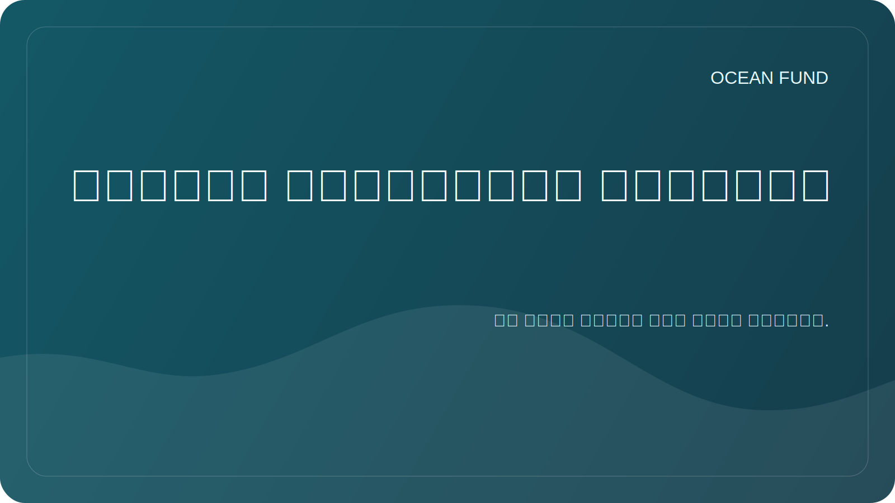

# التنوع البيولوجي المحيطي

## ركز

تساعد دراسة التنوع البيولوجي البحري على تقييم صحة النظم البيئية، وتتبع التغيرات في الموائل، وتحديد الثغرات في الملاحظات، وتثقيف المجتمع حول قيمة المحيط.

## أسئلة البحث

- ما هي المصادر المفتوحة التي توفر بيانات يمكن التحقق منها عن وجود الأنواع البحرية؟
- أين توجد فجوات المراقبة عبر المناطق والأعماق والمجموعات التصنيفية؟
- ما هي المؤشرات التي يمكن استخدامها للمواد التعليمية والعامة؟
- كيف يمكن تصور التنوع البيولوجي بشكل صحيح دون تبسيط المعنى العلمي؟

## المصادر المحتملة

| مصدر | التطبيقات الممكنة |
| --- | --- |
| أوبيس | تواجد الأنواع، السجلات التصنيفية، جغرافية الملاحظات |
| فهم نت | الصور المشروحة تحت الماء ومهام رؤية الكمبيوتر |
| GBIF | سياق إضافي بشأن التنوع البيولوجي إذا كانت التراخيص والجودة مناسبة |
| المنشورات العلمية | التحقق من المنهجيات والشروط والقيود |

## النتائج المحتملة

- خريطة مصادر التنوع البيولوجي البحري؛
- قائمة مؤشرات المواد العامة؛
- دفتر ملاحظات مع مثال لتحميل السجلات المفتوحة؛
- ملخص قصير للشركاء للمتاحف والمواقع التعليمية.

## قيود

قد تكون بيانات حدوث الأنواع غير كاملة ومتحيزة حسب المنطقة وطريقة المراقبة. يجب أن يصف أي تصور بوضوح المصدر وتاريخ الوصول والقيود.
