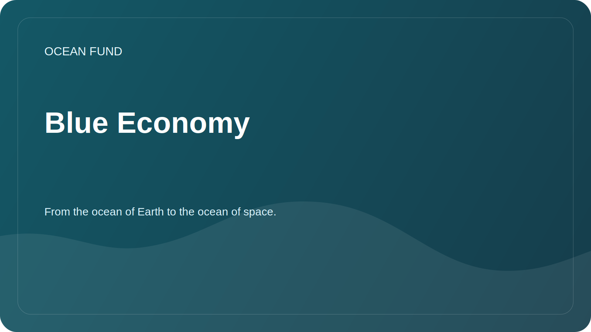

# Blue Economy

## Focus

Blue economy describes economic activities related to the ocean and water resources in a sustainable, science-based and socially responsible manner.

Ocean Fund uses this term carefully: not as a promotional slogan, but as a frame for discussing the balance between development, ecosystem protection, and public benefit.

## Questions

- What criteria allow us to distinguish sustainable maritime projects from declarative ones?
- What data is needed to assess impacts on ecosystems?
- How can universities, museums, foundations and technology teams get involved in the sustainable ocean agenda?
- What public materials help explain the blue economy without greenwashing?

## Topics for Analysis

| Subject | Possible result |
| --- | --- |
| Sustainable Shipping | Overview of data, terms and limitations |
| Coastal communities | Map of Questions for Partner Research |
| Marine technology | Catalog of solutions with readiness level and sources |
| Education | Materials for lectures, exhibitions and open programs |

## Restrictions

Economic benefits, investment prospects, or project status should not be claimed without verified sources and separate verification.
