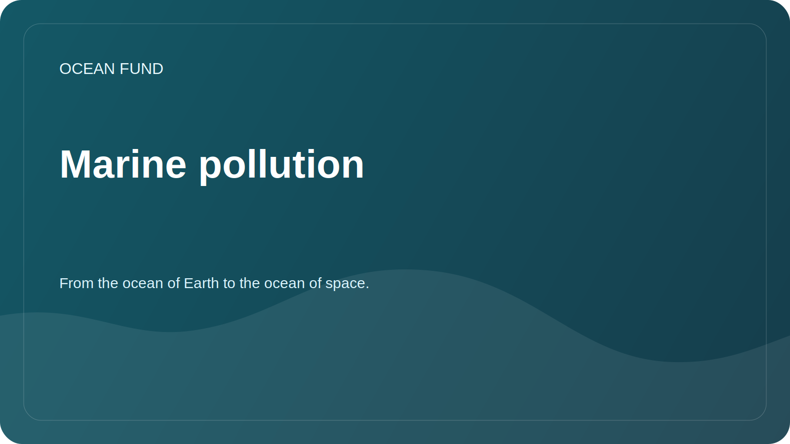

# Marine pollution

## Focus

Marine pollution includes plastic, microplastics, petroleum products, chemicals, sewage, noise pollution and other human impacts. The section helps to put together a careful research framework without untested claims.

## Research Questions

- What types of pollution can be tracked using open data?
- What data requires local observations and partnerships?
- How do you differentiate between observation, model, risk assessment and public campaign?
- Which visualizations are suitable for educational programs?

## Topic Matrix

| Subject | Possible data | Risk of interpretation |
| --- | --- | --- |
| Plastic and trash | Field observations, citizen science, reports | Incomplete coverage and different techniques |
| Oil pollution | Satellite images, service reports | Expert verification required |
| Eutrophication | Chlorophyll, biogeochemistry, local measurements | Cannot be directly reduced to one indicator |
| Noise | Specialized measurements | Limited data availability |

## Possible results

- map of sources and methods;
- pollution case card template;
- educational material about types of pollution;
- list of partners for local observations.
