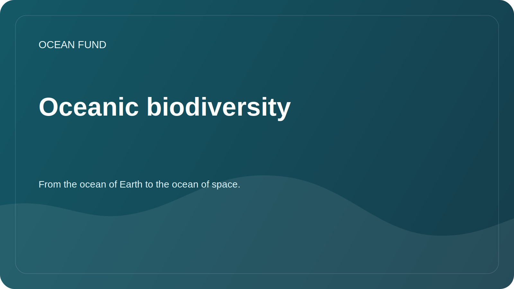

# Oceanic biodiversity

## Focus

Studying marine biodiversity helps assess the health of ecosystems, track habitat changes, identify gaps in observations, and educate society about the value of the ocean.

## Research Questions

- What open sources provide verifiable data on the occurrence of marine species?
- Where are the observation gaps across regions, depths, and taxonomic groups?
- What indicators can be used for educational and public materials?
- How to correctly visualize biodiversity without simplifying the scientific meaning?

## Potential sources

| Source | Possible applications |
| --- | --- |
| OBIS | Species occurrence, taxonomic records, geography of observations |
| FathomNet | Annotated underwater images and computer vision tasks |
| GBIF | Additional context on biodiversity if licenses and quality are appropriate |
| Scientific publications | Checking Methodologies, Terms and Limitations |

## Possible results

- map of sources on marine biodiversity;
- list of indicators for public materials;
- notebook with an example of loading open records;
- short partner brief for museums and educational sites.

## Restrictions

Species occurrence data may be incomplete and biased by region and observation method. Any visualization must clearly describe the source, access date, and restrictions.
