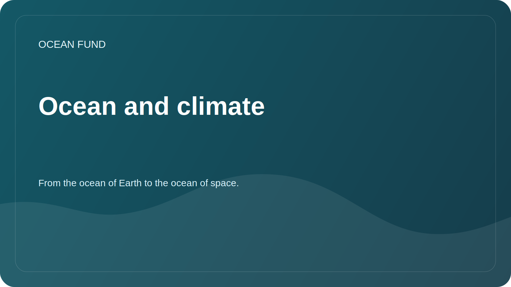

# Ocean and climate

## Focus

The ocean stores heat, participates in the carbon cycle, and influences weather, ice conditions, currents, and coastal stability. The foundation's mission in this area is to help translate complex climate data into neat research and educational materials.

## Research Questions

- Which variables are best for introductory materials about the ocean and climate?
- How do we explain sea surface temperature, sea level, ice, salinity, and chlorophyll without oversimplifying?
- Which datasets are updated regularly and are suitable for demo notebooks?
- How to show uncertainty in models and observations?

## Potential sources

| Source | Variables |
| --- | --- |
| Copernicus Marine | Temperature, salinity, currents, sea level, biogeochemistry |
| NOAA | Climatic and oceanographic observations |
| IOOS | Regional observations and buoys |
| Satellite Products | Surface temperature, ice, ocean color, chlorophyll |

## Possible results

- overview of key climate variables;
- demo visualization for one region;
- glossary of terms for public lectures;
- list of restrictions when working with models and satellite data.
