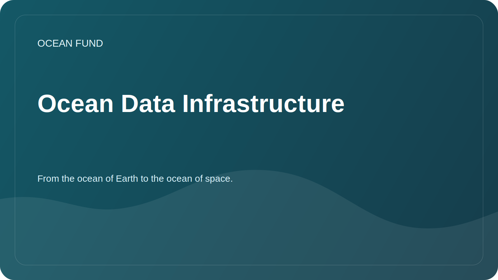

# Ocean Data Infrastructure

## Focus

Data infrastructure is more than just files. These are sources, metadata, licenses, access methods, versions, notebooks, visualizations, quality checks and publication rules.

## Target

Make working with ocean data clear for researchers, developers, volunteers and foundation partners.

## Components

| Component | Why is it needed? |
| --- | --- |
| Register of sources | Quickly understand where to get data |
| Dataset cards | Record license, coverage, format and restrictions |
| Notebooks | Show reproducible analysis examples |
| Metadata | Save context and review date |
| Publication rules | Prevent private data and unconfirmed conclusions |

## First tasks

- fill in [`data/datasets-register.md`](../../data/datasets-register.md);
- select one open source for the demo notebook;
- determine the minimum standard for a dataset card;
- describe the rules for storing derived data.

## Quality criteria

- the source is publicly available;
- the license is clear;
- access date indicated;
- there is a description of the restrictions;
- the analysis can be repeated.
