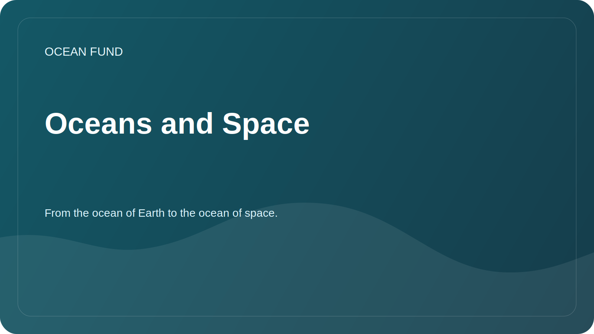

# Oceans and Space

Status: `draft`

This direction connects the earth's oceans with a cosmic perspective. The Foundation can view the ocean not only as a natural system of the Earth, but also as a model for the study of habitability, navigation, data, extreme environments, and future science diplomacy.

## Key frame

The Earth itself is an oceanic world. Studying its oceans helps understand climate, life, chemical cycles, remote sensing, and the limits of habitability. Cosmic "ocean worlds" expand this framework: Europa, Enceladus, Titan and other solar system bodies are discussed through water, ice, internal oceans, organics and energy sources.

## Research Questions

- How do oceanographic methods help astrobiology and planetary science?
- What terrestrial extreme marine environments can be used as analogues of cosmic oceans?
- How does satellite ocean observation link marine science and space infrastructure?
- What NASA, ESA, NOAA and Copernicus data can be used for foundation education and research materials?
- How to talk about “space as an ocean” metaphorically, but scientifically accurately?
- What ocean worlds missions and programs are important for public science communication?

## Thematic blocks

| Block | What's included | Possible result |
| --- | --- | --- |
| Earth as an ocean world | The Earth's Ocean as a System of Climate, Life and Data | public brief |
| Remote sensing | Ocean color, surface temperature, ice, chlorophyll | dataset card, visualization |
| Ocean analogs | Hydrothermal vents, subglacial environments, deep seas | review of analogues |
| Planetary habitability | Water, energy, chemistry, organics, ice shells | glossary and concept map |
| Ocean worlds missions | Europa Clipper, Cassini heritage, future missions | timeline и partner brief |
| Culture and navigation | Sea and space as research environments | text for a lecture or exhibition |

## Primary sources

| Source | What is it for? |
| --- | --- |
| NASA Ocean Worlds | review of space ocean worlds and missions |
| NASA Astrobiology | habitability, extremophiles, search for life |
| NASA Ocean Color | satellite data on ocean color and biogeochemistry |
| NASA PACE | modern measurements of the ocean, atmosphere and climate |
| Copernicus Marine | regular monitoring of ocean conditions |
| NOAA / Argo | ocean observations and profiles |
| ESA Earth Observation | satellite observation of Earth and ocean |

## Result formats

- review "Earth as an Oceanic World";
- source cards NASA Ocean Color, PACE, Copernicus Marine, Argo;
- lecture "Ocean below, ocean above";
- visualization links: oceanology -> remote sensing -> astrobiology -> public science;
- list of partners: planetariums, science museums, university laboratories, space and marine research centers.

## Risks of wording

- Do not assert the presence of life on cosmic ocean worlds.
- Separate scientific data from the “space is like an ocean” metaphor.
- Check mission dates and program status before public use.
- Do not confuse educational analogies with proven scientific findings.
